# 📈 Bar Replay Pro — Backtesting vela a vela de Bitcoin y criptomonedas

Aplicación web completa para **practicar trading en tiempo simulado**: carga velas
históricas reales de Binance, oculta el futuro y te deja avanzar la gráfica
**vela a vela** mientras dibujas, analizas y operas con dinero virtual. Al terminar
obtienes estadísticas profesionales de tu rendimiento (win rate, profit factor,
drawdown, curva de capital y más).

  

> 🔗 **Proyecto hermano:** [**OpenMarket Chart — clon en React + Vite**](https://luisnav83-hash.github.io/openmarket-chart/) ·
> reconstrucción propia del terminal de gráficos de `openmarket.xyz/chart/r8e6KKi7`
> (mismo layout medido, gráfico real con indicadores, paneles y dibujos).
> Código: [github.com/luisnav83-hash/openmarket-chart](https://github.com/luisnav83-hash/openmarket-chart)

---

## ✨ Funcionalidades

### 1. Gráfico de velas
- Renderizado con **TradingView Lightweight Charts v4** (incluida localmente en `vendor/`).
- Temporalidades: **1m · 5m · 15m · 1h · 4h · 1d · 1w**.
- Zoom, scroll, cruceta con precio/fecha, escala **automática o manual** (fija),
  escala **lineal o logarítmica**, velas alcistas en verde y bajistas en rojo.
- Bloqueo opcional del scroll para no mover la vista sin querer.

### 2. Sistema de Bar Replay
- **PLAY / PAUSA**, **avanzar** y **retroceder** una vela, **reset** al inicio y salto al final.
- Velocidades **0.5x · 1x · 2x · 5x · 10x · 50x · MAX** (bucle con `requestAnimationFrame`
  y acumulador: nada se pierde aunque la pestaña se ralentice).
- Barra de progreso arrastrable, reloj de la vela actual (UTC) y **contador de velas ocultas**.
- Las velas futuras **nunca** se envían al gráfico: solo se dibuja hasta el cursor.
- Al **retroceder**, la cuenta se reconstruye desde *checkpoints*: balance, historial
  de trades y posición vuelven exactamente al estado de esa vela.

### 3. Herramientas de dibujo (persistentes)
Línea de tendencia · línea extendida · soporte/resistencia horizontal · línea vertical ·
rectángulo/zona · **canal paralelo** (3 clics) · **retroceso de Fibonacci** ·
**medición** (Δprecio, Δ%, nº de velas y tiempo) · **flecha** (2 clics, atajo `A`) ·
**camino/polilínea** (clics y doble clic o `Enter` para cerrar, atajo `P`).
Color, grosor y estilo configurables, selección y arrastre con el ratón, imán a OHLC
de las velas. Los dibujos se anclan a **tiempo + precio**, así que siguen en su sitio
al hacer zoom, scroll o avanzar el replay.

**Gestor de dibujos** (pestaña «✏️ Dibujos» del panel inferior): cada dibujo aparece
con su color, su nombre y su punto de anclaje, y se puede **renombrar** (doble clic en
el nombre), **ocultar sin borrar** (👁, desaparece del gráfico y no molesta al pasar el
ratón) o **eliminar** (✕), además de «🚫 Ocultar todos» y «🗑️ Borrar todo» (con
confirmación). Lo oculto y los nombres propios se guardan en la sesión y en la
instantánea.

### 4. Indicadores técnicos (cálculo propio, sin librerías)
| Indicador | Parámetros | Panel |
|---|---|---|
| SMA | período | principal |
| EMA | período | principal |
| EMA 2 | período | principal |
| Bollinger | período + k desviaciones | principal |
| Volumen | color | principal (histograma inferior) |
| RSI (Wilder) | período | panel inferior |
| MACD | rápida / lenta / señal | panel inferior (línea + señal + histograma) |
| ATR (Wilder) | período | panel inferior |

Todos son **causales**: el valor de una vela solo depende de velas pasadas, así que
mirar el indicador nunca revela el futuro.

### 5. Trading simulado
- **BUY/LONG** y **SELL/SHORT** con tamaño en **% del equity**, **USD de exposición** o **cantidad**.
- **Capital inicial** configurable (por defecto 10.000 $) y **apalancamiento** 1x…100x
  (deslizador `#levRange`, como en el panel de futuros) con **precio de liquidación estimado**.
- **Modo de margen Cruzado / Aislado** (el seg de arriba del panel de órdenes). Cambia la
  liquidación, no es un adorno: en **Aislado** vuelve la fórmula clásica
  `entrada · (1 ∓ 1/apalancamiento)` y en **Cruzado** respalda también el **margen libre**
  de la cuenta → `entrada − lado · (margen + margen libre) / cantidad`, que la aleja
  (`js/tradingEngine.js`: `liquidationPrice`, `marginOf`, `freeMargin`). El modo elegido
  se guarda con la sesión.
- **Comisión** por operación (0,10 % por defecto) aplicada en apertura y cierre; con
  promediado, el break-even mostrado **no** es el precio medio: incluye lo pagado en comisiones.
- **Stop Loss** y **Take Profit**: por precio, con atajos por % o **arrastrando las
  etiquetas SL/TP sobre el gráfico**.
- Ejecución automática de SL/TP durante el replay, con **modelo realista**:
  - si la vela toca SL y TP a la vez → modo **pesimista** por defecto (ejecuta el SL);
  - si hay **hueco (gap)**, la orden se rellena en la apertura de la vela (peor precio).
- **Comisiones** configurables (0,1 % por lado, ida y vuelta) y de **financiación**
  opcional por vela.
- PnL en tiempo real, líneas en el gráfico de entrada/SL/TP/liquidación y métricas
  del trade (MFE/MAE, R múltiplo, duración en velas y tiempo).

- **LA POSICIÓN QUEDA MARCADA EN EL GRÁFICO y su PnL se ve subir y bajar**
  (`js/pnlChart.js`): al abrir, una **banda** va de la vela de entrada al precio
  actual (verde si gana, roja si pierde), con un **tick** en la vela de entrada y
  una **etiqueta** pegada al precio actual que dice lado, tamaño, precio de
  entrada, PnL en $, % sobre el margen y una flecha ▲/▼/= con el movimiento de la
  última vela. Debajo del gráfico se abre un **panel de PnL**: la curva del PnL no
  realizado vela a vela (línea rellena, con líneas en el máximo y el mínimo del
  recorrido) y el recuento «N velas desde la entrada».
- **El número no se inventa**: sale de `TE.unrealized(App.currentPrice())`, el
  mismo del que vive la tarjeta de la posición, y la marca **sigue a la vela** al
  hacer scroll, zoom, cambiar de temporalidad o redimensionar. Las velas futuras
  no se pintan: la curva se corta en el cursor del replay.
- **Cada hito deja su marca sobre la vela**: la entrada, cada promediado
  (`#2`, `#3`… con el precio media resultante), cada cierre parcial (con lo
  realizado) y el `CERRADO` con el **PnL neto** de la operación (comisiones
  incluidas, o sea el mismo que se cobra la cuenta). Al cerrar, el resumen **se
  queda** en pantalla y la curva se queda congelada en sus velas: se puede seguir
  moviendo el replay sin que crezca.
- **El panel de PnL se estira**: arrastra su asa (⬍, pegada al borde superior del
  panel) **con el ratón o con el dedo** y el panel crece comiéndole sitio al gráfico;
  con **Mayús + ↑/↓** el paso es de 40 px y con **doble clic** vuelve al suyo. El alto elegido se recuerda
  (`ST 'pnlPaneAlto'`), se **recorta solo** a lo que cabe y el asa no se come la ✕ del
  panel ni convierte el gesto en scroll (`touch-action: none`). El recorte no es un
  porcentaje escrito a mano: `PC.techoAlto()` mide el **hueco real** —alto del
  `#chartArea` menos barra de dibujo, menos barra de replay, menos lo que la escalera
  tiene pagado fuera del PnL y menos el suelo de CSS del gráfico—, así que estirar **no
  puede** dejar a las velas por debajo de su suelo. En el teléfono, además, estirar por
  encima del alto de defecto **pliega el resto de la escalera** (el RSI/MACD/ATR estaban
  ahí abajo y vuelven solos con el doble clic o al devolver el panel al suyo): en
  390×844 no caben a la vez velas grandes, PnL grande y RSI. Y si lo que se abre son
  VARIOS indicadores, en lugar de taparse unos a otros la escalera se aprieta
  (`PC.comprimeEscalera`, con su suelo de 40 px por panel): ver la nota técnica de abajo.
- **Mini-PnL en la tarjeta de la posición**: junto al «PnL no realizado» hay un
  pantallazo de 26 px con el mismo recorrido del panel (relleno desde el nivel 0,
  línea en el color del signo, punto en el valor de ahora y nota con el máximo y el
  mínimo). Se pinta a mano en un `<canvas>` a la resolución real del dispositivo, así
  que no hay que levantar la vista del formulario para saber si la cosa mejora.
- **Cada trade cerrado lleva su recorrido en el historial**: la tabla de trades gana
  una última columna, «Recorrido», con una mini-curva de 46×16 px del PnL no realizado
  que tuvo esa operación — con su máximo y su mínimo escritos en el `title` de la celda.
  El recorrido **viaja dentro del trade** (`pnlPath`, recortado a 64 puntos *conservando
  el máximo y el mínimo*, más `pnlMax`/`pnlMin`), así que no se recalcula al pintar la
  tabla: sobrevive a cambiar de temporalidad, a olvidar la traza del gráfico y a
  recargar la sesión. La fila de la posición **abierta** tiene su propia mini-curva en
  vivo, que pinta el mismo motor del panel (`PC.paintMini` → `UI.paintLiveSparks`) en
  cada vela del replay. Un trade cerrado antes de esta versión no lo inventa: su celda
  queda vacía y el `title` lo dice.

- El marcaje se apaga y enciende con **📈 PnL** en la barra del gráfico y la
  preferencia se recuerda (`ST 'pnlGrafico'`). La capa es `pointer-events: none`
  y queda por debajo de la leyenda (`z-index` 5 < 6): no se come ni el dibujo a
  mano ni el gesto, y en ≤640 px la etiqueta se encoge (176×48) y se coloca
  **por debajo** de la leyenda OHLC cuando el precio está arriba del todo. El **mini de
  la tarjeta no depende de ese interruptor**: es información de la posición, no del
  gráfico, así que sigue contando mientras la posición esté abierta (así lo exige
  `tests/pnl-chart.test.js`, bloque H).

### 6. Estadísticas y resultados
Balance · equity · PnL total y abierto · margen usado y exposición · nº de trades ·
ganadores/perdedores · **win rate** · **profit factor** · **payoff** · expectancy ·
**R medio** · **máximo drawdown** ($ y %) · mejor y peor trade · rachas ·
**curva de capital** en vivo · tabla completa del historial (entrada, salida, dirección,
precios, tamaño, PnL, %, R, motivo de cierre y duración).

### 7. Gestión de datos
- **Binance** `/api/v3/klines` con **paginación automática** de 1000 velas y 6 hosts espejo.
- **Catálogo de símbolos** `/api/v3/exchangeInfo` (1.100+ pares reales) para el buscador,
  con proxy propio en `server.js` y caché de 6 h; si no hay red, lista local de 40 pares.
- **Fallback a CoinGecko** si Binance no está disponible.
- **Caché local** (localStorage) de lo descargado, con aviso de velas en caché.
- Importación de **CSV** (con o sin cabecera, separador `,`/`;`/tabulador, fechas ISO o epoch).
- Modo **Demo**: 3.000 velas sintéticas deterministas para practicar sin conexión.
- Selector de **rango de fechas** y de **par** con **BUSCADOR DE SÍMBOLOS** (botón
  del par o `Ctrl+K` / `/`): catálogo de Binance por **categorías** (⭐ Favoritos,
  🕘 Recientes, 🔥 Principales, 💵 USDT, USDC, BTC, ETH y todos), **búsqueda en vivo**
  por texto y ⭐ para marcar favoritos (se recuerdan en el navegador). 40 pares de
  referencia siempre disponibles aunque no haya red.

### 8. Extras
- **DIBUJAR MANTENIENDO PULSADO** (gesto, estilo tableta gráfica): mantén pulsado
  ⅓ s sobre el gráfico y traza una forma; al soltar, se reconoce sola y se
  convierte en el dibujo que parece: un trazo horizontal → soporte/resistencia,
  vertical → línea de tiempo, diagonal → línea de tendencia, cuatro lados →
  rectángulo/zona, un bucle → elipse, un zigzag → retroceso de Fibonacci.
  Un **garabato** encima de un dibujo lo borra. Mientras dibujas, el gráfico no
  se desplaza (se bloquea la panorámica). Se puede desactivar en Ajustes
  (`gestureDraw`). El reconocimiento es geométrico (giro acumulado, cierre,
  rectitud), sin librerías externas.
- **PANEL DE INDICADORES con valores en vivo** (estilo terminal de trading): la
  tarjeta «📈 Paneles» lista todos los indicadores con su valor actual —Vol, SMA,
  EMA, EMA2, BB, RSI, MACD (hist/macd/señal) y ATR— y se actualiza en cada vela
  del replay. Cada fila lleva punto de color, ojo 👁 para mostrar/ocultar la serie
  en el gráfico y abre la configuración al hacer clic.
- **ÓRDENES LÍMITE**: se colocan y esperan; el replay las ejecuta solas al llegar
  el precio (línea ámbar punteada + tarjeta «⏳ Órdenes pendientes» con botón ✖).
- **BUSCADOR DE SÍMBOLOS Y TEMPORALIDADES RÁPIDAS**: el botón del par abre el catálogo
  de Binance con categorías, buscador en vivo y favoritos ⭐; al lado, los botones
  `1m · 5m · 15m · 1h · 4h · 1d · 1w` cambian la temporalidad al instante. El par
  elegido se recuerda en «Recientes» y la leyenda del gráfico se sincroniza siempre.
  Si no hay datos para esa combinación, avisa y cae a las velas guardadas o a DEMO
  (nunca deja el gráfico desincronizado del par o la temporalidad elegidos).
- **Guardar/cargar sesiones** completas (replay, dibujos, indicadores, trades, cuenta).
- **Exportar**: trades a CSV · curva de capital a CSV · velas visibles a CSV ·
  sesión a JSON · **informe imprimible → PDF** (incluye captura del gráfico).
- **Captura de pantalla** del gráfico (velas + dibujos + paneles) en PNG.
- **Modo práctica rápida**: fecha aleatoria y a operar.
- **Atajos de teclado**, sonidos sintetizados (WebAudio) y diseño responsive.
- **⚙️ Ajustes abre de verdad**: el botón rellena y abre el modal (`UI.openModal('modalSettings')`,
  que es quien llama a `UI.openSettings`); al reabrir, los interruptores reflejan el estado real
  del motor —no el valor con el que nació la página—, incluido «➕ Promediar entradas».

---

## 🖥 Interfaz: terminal de futuros (piel Bitunix)

La interfaz es una **reproducción de la pantalla de futuros de Bitunix**: misma
organización, misma jerarquía visual y mismas interacciones, escrita desde cero
aquí. **No** se usa el logo, el nombre ni ningún recurso del exchange: es un
*look & feel*, no una suplantación.

**Las cinco zonas, como en el original**

| Zona | Qué hay | Dónde |
| --- | --- | --- |
| 1 · Barra superior | par + temporalidades rápidas y **fila de estadísticas de 24 h** (último con flecha, %, máx/mín, volumen, mark & index, **funding con su cuenta atrás** y OI) | `#topbar` → `#bfStats` |
| 2 · Gráfico | velas + toolbar de dibujo + paneles de indicadores + barra de replay | `#chartArea` |
| 3 · Libro de órdenes | ventas en rojo leídas **de mayor a menor hacia el precio** (la mejor venta, justo encima del último), precio último centrado con flecha, compras en verde **de menor a mayor hacia abajo**, columna **Total** acumulada (máxima en la fila lejana) y **ratio B % / S %** al pie | `#bookCard` (`js/orderBook.js`) |
| 4 · Panel de órdenes | modo de margen, apalancamiento, tipo (⚡ Mercado / ⏳ Límite), unidad (% equity / USD / Qty), **0 · 25 · 50 · 75 · 100**, TP/SL rápidos, **Coste** y **Margen** calculados en vivo y `Abrir Long` / `Abrir Short` | `#orderCard` |
| 5 · Pestañas | Posiciones · Órdenes · Operaciones · Cuenta · Estadísticas · Registro · Dibujos, con contadores en las cabeceras | `#bottomPanel` |

**Interacciones copiadas (y probadas)**

* **Pulsar un precio del libro** rellena el campo de precio límite y salta al modo
  «⏳ Límite», igual que en el exchange.
* El botón **fijar** del libro ancla los niveles al precio de la vela del cursor:
  en un replay el libro no puede «seguir» al reloj.
* **0/25/50/75/100** convierte según la unidad elegida: el 50 % significa 50 % del
  disponible en `% equity`, 50 % del notional en `USD` y media cantidad en `Qty`.
* Con tamaño 0 los botones de compra/venta se **deshabilitan** (no hay orden posible),
  y `#bfCostVal` / `#bfMarginVal` siempre dicen lo que el motor va a hacer.
* Cambiar **Cruzado ↔ Aislado** con posición abierta **mueve la liquidación** visible
  de la tarjeta `Posición abierta`.

**Paleta medida de la captura de referencia** (no inventada): fondo `#0a0a0b`,
sube `#25ca93`, baja `#f65b55`, acento lima `#b8f040`, ámbar para funding y
liquidación `#f0b90b`, texto `#e6e7ea` / `#8b8e96`, **radio 0** en las tarjetas,
cuerpo 12 px, precio 17 px, botones Long/Short de 38 px, fila de libro de 17 px.
Todo vive en `css/bitunix.css`, que se carga **la última** para poder reescribir
al tema anterior sin tocarlo.

**De dónde sale cada dato (y qué no es real)**

| Dato | Origen auténtico | Cómo se etiqueta |
| --- | --- | --- |
| Velas OHLCV | Binance **spot** por `server.js` (espejo `data-api.binance.vision`); en el archivo único, la instantánea de velas reales incrustada | leyenda del gráfico |
| 24 h (%, máx/mín, volumen) | `GET /api/v3/ticker/24hr` por el **mismo origen** (proxy de `server.js`); sin red, `—` | `title` de `#bfChg24`: «Variación de 24 h REAL (espejo spot de Binance)» |
| Niveles del libro | **DERIVADOS** de la vela del cursor de forma determinista (`OB.derivedBook`): no existe un libro histórico por vela y fingirlo sería mentira. Se piden 10+10 y se pintan con las lejanas recortadas (`.bf-asks`/`.bf-bids` con `max-height` y `overflow:hidden`), de modo que el precio central y las filas pegadas a él **siempre** se ven | `#bookSrc` = `derivado`; `#bfSource` = «libro: derivado del replay» |
| Mark & Index | mark = cierre de la vela actual; index = media corta de cierres | etiqueta «derivado» en el `title` |
| Funding, cuenta atrás, OI | **Bitget USDT-FUTURES** (`current-fund-rate` y `ticker`) vía `/api/market/*` de `server.js`; en Pages, CORS directo con la API pública | `#bfSource` añade «mark/OI/funding: Bitget» |
| Ratio long/short | Bitget `account-long-short` (nº de cuentas, 1 h) | pie del libro `B % / S %` |
| Comisión, margen, PnL | locales del motor de práctica | — |

Regla: **un dato derivado jamás se presenta como real**. Si no hay red, funding, OI y
long/short pasan a `—` y el libro sigue siendo utilizable porque nunca prometió ser real.

**En el móvil, el panel de órdenes manda.** A ≤640 px la franja del terminal
crece a 250 px y la barra `Abrir Long / Abrir Short` se queda **fija al pie** de
la tarjeta: se puede operar sin rellenanar el formulario entero. Y ninguna fila
del formulario se aplasta: con `max-height` en el cuerpo, el `flex-shrink` por
defecto dejaba los segmentados a 2 px (botón vivo pero invisible), así que
`#sidebar > .card > .card-body > *` es `flex: 0 0 auto`. Lo comprueba
`tests/bitunix.test.js` trayendo cada fila a la vista y mirando qué elemento
recibe el puntero. La misma suite exige además que **ningún control visible** del
panel de órdenes mida menos de 20 px de alto: el deslizador de apalancamiento tenía
la barra fina por diseño (`height: 3px`) y con el dedo era imposible de agarrar, así
que ahora la caja del `input[type=range]` mide 22 px y la pista sigue viéndose de 3 px.

**Y el formulario cabe: 510 px dentro de 214 ya no existen.** Medido a 390×844 antes de
esto: el cuerpo del panel pedía 510 px y la caja le daba 214, con **15 de sus 26 controles**
fuera del recorte (`q0…q4`, la comisión, SL, TP, los seis atajos de % y «Cerrar todo» vivían
bajo el borde, sin barra que lo avisara). Tres cosas, en este orden:

- **Las dos filas de segmentados pasan a una línea** (Mercado|Límite y %equity|USD|Qty,
  ~308 px dentro de 374) y las cuatro filas de arriba se aprietan al mínimo que sigue
  siendo diana: 24-28 px de alto por fila, botones de tipo a 24, campos a 24, Long/Short
  a 34. Son 40 px devueltos al gráfico sin esconder nada.
- **«Avanzado» es la única fila que se pliega** —comisión, SL, TP y sus seis atajos, 149 px—
  con un botón en la *cabecera* de la tarjeta (`#btnOrderAvanzado`, `aria-expanded` como única
  fuente de verdad) y la preferencia guardada en `localStorage` (clave `ordenAvanzado`), porque
  quien trabaja con SL/TP no debería abrir el panel cada vez. La pista de texto (`#orderHint`)
  y la del modo límite (`#limitHint`) se quedan fuera en el teléfono: repiten lo que ya dicen
  los `title`; los elementos siguen en el DOM, solo deja de pintarlos el CSS.
- **Lo que no cabe lo desliza la TARJETA, no la página.** `#orderCard > .card-body` es
  `overflow-y:auto` con `min-height:0` dentro de la franja topada: abrir «Avanzado» (o pasar a
  modo Límite, que añade 54 px) no le quita **un píxel** al gráfico. Y para que un pie cortado
  no parezca un dibujo roto, `UI.initOrdenAvanzado` pone `#orderCard.desborda` cuando
  `scrollHeight > clientHeight` y CSS pinta un degradado de 14 px (con `scrollIntoView` basta
  para llegar a SL/TP con el dedo; `overscroll-behavior:contain` evita que deslizar la tarjeta
  arrastre también la página).

Medido ahora, a 390×844 con la app recién abierta: franja 250 → tarjeta 249 (cabecera 28 +
cuerpo 221) contra **222 px de contenido** —en reposo no hay nada que deslizar—, **18 de 18
controles alcanzables**, documento 844 = 844 (no desliza) y **188-189 px de fila de gráfico**
los que se reparten con la escalera: eran 146 antes de este paso y 43 al empezar el trabajo del
móvil. Abriendo «Avanzado»: gráfico idéntico (188 contra 189 —±2 px del redondeo del reparto—),
franja en su tope (250), solape 0, desborde horizontal 0 y 150 px por debajo del pie con su
aviso. Y en esa fila de SL/TP estaba el último defecto gordo: eran `grid-template-columns:1fr 1fr`
con la etiqueta en línea, cada campo pedía 287 px de mínimo de contenido y `1fr` es
`minmax(AUTO,1fr)` —el campo de Take Profit se iba a x 303…601 dentro de una caja de 379, y
`scrollIntoView` lo tapaba desplazando la tarjeta en horizontal (se veía «COMPRAR / LONG»
cortado por el borde izquierdo). A ≤640 la rejilla del formulario pasa a **una columna**: SL
y TP uno debajo de otro, los dos a 363 px de ancho, sin desbordarse.

`tests/responsive.test.js` (bloque «Avanzado del panel de órdenes
en el teléfono», 15 comprobaciones) y `tests/pages-bitunix.js` (bloque móvil, 13) lo comprueban
pulsando de verdad:
cada campo de SL/TP se enfoca con el puntero y acepta el número escrito, y cerrar devuelve
píxel a píxel el estado anterior. La barra `Abrir Long / Abrir Short` sigue fija al pie.

Dos piezas del gráfico también estaban en su sitio solo «de casualidad» y se han
colocado bien: el aviso de **velas ocultas** ya no es un `position:absolute` suelto
sino un elemento más de la leyenda OHLC (va en su línea y no pisa nunca el `O/H/L/C`,
que es lo que hacía cuando la leyenda ocupaba dos filas), y el crédito
«Lightweight Charts™» se aparta de la franja derecha donde el eje pinta sus etiquetas.
En ≤640 px la leyenda baja a 10 px de letra y deja de repetir el origen de los datos
(esa información ya está en la fila de estadísticas de arriba), para no comerse 131 px
de los ~200 px de gráfico que quedan: se queda en ~75 px. `tests/bitunix.test.js`
mide los rectángulos y no deja solapar ninguna de las tres piezas (5 comprobaciones
nuevas: aviso dentro de la leyenda, altura de la caja y holgura con el eje, medidos
también a 1440 px).

**La barra de replay del teléfono: una línea y todo al alcance.** Medido en 390×844 sobre el
build local: la barra medía 38 px de alto con **795 px de contenido dentro de 389 de caja**, el
deslizador de posición empezaba en x 458 —fuera de la barra— y su caja era de **4 px** de alto.
Y no era solo ancho: `css/chart.css` pone el bloque de progreso en columna
(`.rb-progress{flex-direction:column}`) y `css/responsive.css`, a ≤900, envuelve la barra
(`flex-wrap:wrap` + `.rb-progress{flex:1 1 100%}`) → la segunda línea —hora, contador,
porcentaje, estado— caía **por debajo del borde inferior** de una barra de 34 px, y en la barra
no hay scroll vertical donde buscarla. Es decir: en un móvil la posición del replay **nunca se
había visto**. En ≤640 queda una sola línea de 34 px con `order` transporte → posición →
velocidades, el deslizador fijo a 76×20 px (caja táctil) y fuera de la fila lo que está
duplicado: `#pbTime`, `#pbSpeed` y `.rb-clock` (la hora UTC ya está en la leyenda OHLC y la
velocidad en el chip activo) y `#pbPct` (el contador «vela 1152 / 1200» dice lo mismo con más
precisión). Contenido ahora 644 px en 389: **se puede tocar sin deslizar** lo que hay que tocar
—los cinco botones, a 24 px de alto, y la línea de posición— y la cola de velocidades se
alcanza deslizando la propia barra (`overflow-x:auto`); no se esconde nada, se desplaza.

**El deslizador hablaba en otra escala.** `UI.refreshReplayBar` escribe
`Math.round(fracción·1000)` y `App.seekFromSlider` divide entre 1000, pero el `<input>` de
`index.html` tenía `max="100"`: el navegador **clampaba** el valor —la perilla vivía pegada al
extremo derecho desde la primera vela (medido: índice 299/1500 → `value` 100; índice 1050 →
100)— y arrastrarla no salía del 10 % del histórico (escribir 500 se leía 100 → 10 %). Con el
tope en 1000 la ida y vuelta cierra: poner el replay en la vela 70 % deja la perilla en 700
puntos, y poner la perilla en 500 lleva el replay a la mitad (50 %).

**Y la perilla dejaba de seguirte en cuanto la tocaban.** El repintado escribía el valor «salvo
que el deslizador tenga el foco» (`document.activeElement !== slider`), de modo que después de un
arrastre —el foco se queda puesto— la perilla se congelaba mientras el contador seguía subiendo
(en la captura: «vela 850 / 2000» con la perilla en el 20 %). El permiso vive ahora en
`UI._arrastrandoSlider`, que se pone en `pointerdown` y se quita en `pointerup`, en
**`pointercancel`** y en el `blur` de la ventana —en el teléfono el gesto se cancela en cuanto el
deslizamiento de la barra se lo lleva, y sin esa rama el replay se quedaba pausado con la perilla
pillada hasta recargar—; y `acabarDrag()` refresca la barra al soltar, porque el repintado no
espera al arrastre: sin ese refresco la perilla tardaba hasta la vela siguiente en engancharse
(medido: valor 24 con el replay en el punto 426 de 1000, un segundo entero a 1×).

Lo vigilan `tests/responsive.test.js` (bloque «La barra de replay del teléfono», 12
comprobaciones) y `tests/pages-bitunix.js` (13 en el bloque móvil, sobre lo publicado). Dos
detalles del cómo, que son la lección: se miden **los cuatro bordes** de cada control contra los
de la barra —comprobar solo el derecho, como hacía la primera sonda, dejaba pasar el recorte
vertical por abajo—, y cada chip de velocidad se declara alcanzable solo si se puede pulsar en
**algún** punto del deslizamiento, no en la foto de reposo.

**La escalera de indicadores: el eje de tiempo se pinta donde hay hueco.** Medido en 390×844
antes de tocar: cada panel medía 44 px, su cabecera 24 y el gráfico del panel se quedaba en
**2 px** —porque el eje de tiempo (las etiquetas de hora, entre 26 y 28 px de franja) se
pintaba *dentro* del panel más bajo, y el único sitio que le quedaba era el hueco del
indicador—. No era cosa del móvil: a 1440×900 el MACD pintaba 12 px, y a 1400×560, 900×700 y
1000×780, 2 px. El criterio pasa a ser de **hueco, no de posición** (`CM._reparteEje`,
`js/chart.js`): el eje se queda en el panel de abajo solo si a ese panel le quedan ≥ 48 px de
gráfico; si no, se pinta en el chart principal —el sitio que la app ya usa cuando no hay
ningún panel abierto— y los paneles conservan su hueco entero. En el teléfono, con paneles de
56 px, eso significa 30 px de RSI/MACD reales (antes 2) y un eje bajo las velas.

**Y en el teléfono la escalera se desplaza, no se aplasta.** Los paneles suben de 44 a 56 px
con el PnL a 60, y la escalera se topa a la fila que ya tenía (117 px) con `overflow-y:auto`:
lo que no cabe se alcanza deslizando en vez de comérselo el gráfico. La cuenta es la que fija
los números: 60 + 56 = 116 ≤ 117, así que **la escalera por defecto cabe entera y no hace
falta deslizar nada**; con dos indicadores abiertos, el tercero está a 56 px de deslizamiento.
Con la escalera por defecto, el gráfico del teléfono queda en **252 px** de fila (era 189 al
empezar el hilo del móvil y 43 cuando este trabajo comenzó). Dos reglas que no son ornamentales:
`#paneArea` es `display:flex;flex-direction:column`, así que a los hijos hay que ponerles
`flex:0 0 auto` —sin eso, con el `max-height` puesto los paneles **encogían a 36 px (8 px de
gráfico)** en lugar de desbordar: el mismo defecto con otro disfraz, y el mismo que obligó a
`flex:0 0 auto` en la barra de replay—; y la compresión de `PC.comprimeEscalera` **se salta el
teléfono** (y limpia los `style.height` que hubiera dejado una ventana ancha), porque su
trabajo allí lo hace el desplazamiento.

**Destapado al medir la propia captura:** la cabecera del MACD no cabía en una línea a 390 px
(82 de título + 268 de valores + 22 de ✕ + 10 de huecos), partía sus valores en dos líneas y
la segunda se pintaba **encima del gráfico del panel**. Con la letra a 10 px, el hueco a 5 y
los **parámetros fuera de la cabecera** (`#rsiParams`, `#macdParams`, `#atrParams`: son fijos y
están en el panel de ajustes, mientras los valores son lo único que cambia) son 345 px en 389:
una línea, cero ellipsis. El `text-overflow:ellipsis` se deja puesto como degradado limpio, y
el contrato exige que no se use: se comprueba `scrollWidth <= clientWidth` en los tres anchos.
El asa del PnL pasa de 12 a 18 px y la ✕ de cada panel, de 20×13 a 22×20: tamaño de dedo.

Lo comprueban `tests/responsive.test.js` (bloque «La escalera de indicadores en el teléfono»,
10 comprobaciones: alto y hueco pintado por panel, cap de la fila, deslizamiento hasta el
último panel, eje pintado una sola vez y en el sitio que corresponde, cabeceras de una línea sin
corte y dianas del asa y la ✕) **más dos por cada una de las diez tallas** del bucle general
(`huecoMin >= 12` y el eje), 30 en total: la suite pasa de 103 a 133. Y
`tests/pages-bitunix.js` (115 → 120 sobre lo publicado).
**Una nota sobre el `solape`, que casi se arregla mal:** el contrato «los paneles no tapan la
barra de replay» medía el `getBoundingClientRect()` del último panel, y en cuanto la escalera
pudo desbordar ese número sigue midiendo fuera *aunque ahí no se pinta nada* —el primer rojo
pedía bajar el cap—. La comprobación correcta es contra **la caja que recorta**
(`min(panel.bottom, area.bottom)`), y se añadió aparte que la caja entera termine por encima
del replay. Y para medir dónde se pinta el eje no se pregunta a la librería (v4 no expone
`timeScale().getOptions()`: la primera versión del assert contaba **0 ejes** y daba rojo en
las diez tallas): se mide la franja que le falta al canvas dentro de su contenedor, que es el
eje.


**La barra de dibujo del teléfono: cada control es una diana, y lo que no cabe se alcanza.** Medido
en once tallas antes de tocar, había tres cosas —y solo dos se ven en este motor. (1) La fila que
`#chartArea` le reserva y la caja de la barra salían de **dos reglas distintas**: `--toolbar-h` manda
en las dos (`css/chart.css:18` para la fila, `css/bitunix.css:606` para el alto), pero los tiers de
altura reescribían `#drawToolbar{height}` por su cuenta y el de ≤700 px de alto bajó la caja a 28 y
se olvidó de la variable → **28 px de barra dentro de 30 de fila**, con 2 px de franja muerta justo
donde el tier quería regalarle píxeles al gráfico (169 → **171** a 360×640 y 229 → **231** a
1400×560). El arreglo no es poner 28 en los dos sitios, que callaba el rojo y dejaba la trampa: es
**quitar la segunda fuente**, con lo que el desajuste deja de ser escribible. (2) «⊘ scroll» es un
`<label>` con su checkbox dentro, no un botón, y sin alto propio medía **19 px de diana** en
escritorio mientras el resto de la barra va a 22-27: ahora mide como un `.tool` (`min-height:22px`).
(3) Tercero latente: la barra pedía `scrollbar-width:thin`, que **en Firefox no es superpuesto** y en
Chrome <121 se comía los 8 px de la regla global de `::-webkit-scrollbar` —en una fila de 28-30 px
con controles de 24, eso recorta los botones por abajo y no hay forma de verlo aquí, donde el
scrollbar es superpuesto y la reserva medida es 1 px, que es el borde—. Se pasa a `scrollbar-width:
none` con su `::-webkit-scrollbar{height:0}`, igual que en la barra superior del teléfono.

Y lo que no cabe **no se pierde**: a 390 px la barra tiene 746 px de contenido en 389 de caja (desliza
357) y los **21 controles** tienen su centro pulsable en algún punto del deslizamiento —el mismo
contrato que se exigió a los chips de velocidad y a las ✕ de la escalera, por el mismo motivo, y con
la añadidura de que se exige que algo se quede fuera en reposo (`fueraReposo > 0`): sin eso, el assert
de «todos alcanzables» sería gratis en una barra que cupiera entera—. En reposo se ven las once
herramientas, el color y el grosor **cortándose en el borde derecho**, y ese corte es la señal de que
hay más (captura 48). El dedo manda bien: una pasada de 200 px que empieza *encima* del botón «hline»
desliza la barra y **no** cambia la herramienta ni dibuja —si el `click` se disparara al soltar, cada
pasada cambiaría de lápiz y el usuario se creería trazando una horizontal mientras intenta llegar al
✕ de «borrar dibujos»—; un toque corto en el mismo punto sí cambia a `hline`, que es la otra mitad del
contrato: la barra no se ha quedado sorda.

Lo que **no** se persigue, porque no es un defecto: a 360×640 y 320×568 el documento mide 827 px (antes
847) y la página desliza. Es el formulario de órdenes apilado debajo del gráfico en un móvil bajo, y
deslizar la página ahí es lo correcto —por eso este bloque NO pide `docH === vh` como pide el de la
escalera—; lo que sí se exige es que el gráfico conserve su caja == su fila y que la barra entera sea
zona de controles.

Lo prueban `tests/responsive.test.js` (bloque «La barra de dibujo»: 12 comprobaciones —dos por talla en
cuatro tallas más cuatro del teléfono—, 133 → **145**) y `tests/pages-bitunix.js` (11 en el bloque
móvil sobre lo publicado, 120 → **131**), con el gesto táctil por CDP donde una suite `file://` no
puede llegar. Y el contrato de la fila tiene mordida probada: reproduciendo el estado pre-arreglo en el
fichero construido (variable a 30 y regla suelta a 28) el bloque pone **rojo 360×640 y 320×568** con
los números en el mensaje, y verde en cuanto se quita una de las dos fuentes.

**En ventana baja, el andamio se encoge; el gráfico, no.** `css/bitunix.css` define
los escalones de altura (≤860 / ≤820 / ≤700 / ≤560 px) que recortan estadísticas,
barra de replay y panel inferior hasta ~104 px. Dos leyes probadas por
`tests/responsive.test.js` (103 comprobaciones) y `tests/browser.capture.js``tests/responsive.test.js` (145 comprobaciones) y `tests/browser.capture.js`:
el gráfico conserva ≥150 px (≥200 px si el hueco es de ≥720) y **ningún tope de
altura se pone sin su `overflow`** —un `max-height` con `overflow:visible` dejaba
el botón «⏳ Límite`» fuera de la caja y era inclicable a 1280×820 (de ahí el
regresivo que cazó `tests/limites.test.js`).

---

## 🌐 Publicada en GitHub Pages

El repositorio incluye `.github/workflows/pages.yml`: al subirlo a GitHub, la app
se publica sola y queda accesible desde cualquier navegador (también móvil) en
`https://TU-USUARIO.github.io/TU-REPOSITORIO/`.

- Repositorio: **https://github.com/luisnav83-hash/bar-replay-pro**
- Aplicación completa: **https://luisnav83-hash.github.io/bar-replay-pro/**
- Archivo único (ideal para el móvil): **https://luisnav83-hash.github.io/bar-replay-pro/bar-replay-pro-unico.html**

Esto **ya está subido y publicado** en esas tres direcciones. Si alguna vez se
parte de cero, no hace falta ninguna guía: crear el repositorio en GitHub y
`git init && git add -A && git commit -m "Bar Replay Pro" && git branch -M main &&
git remote add origin <URL> && git push -u origin main` — el workflow
`.github/workflows/pages.yml` se encarga del resto (y el archivo único no
necesita ni build: `bar-replay-pro-unico.html` se sube tal cual y funciona).

---

## 🔗 Proyectos relacionados

### OpenMarket Chart — clon del terminal de `openmarket.xyz` (React + Vite)

- Aplicación: **https://luisnav83-hash.github.io/openmarket-chart/**
- Repositorio: **https://github.com/luisnav83-hash/openmarket-chart**
- Referencia analizada: `https://openmarket.xyz/chart/r8e6KKi7`

Reconstrucción **desde cero**, con código propio, del terminal de gráficos de
OpenMarket: layout, medidas y colores tomados del original (cabecera 40 px, barra
del gráfico 44 px, rail de 52 px, pie de 36 px, paleta `#c8ccd1`/`#d27a61`), gráfico
real con Lightweight Charts, indicadores **calculados a mano** (EMA 20/50,
Bollinger 20-2 con relleno, VWAP, RSI y MACD en panel sincronizado), píldoras
High/Low, precio con cuenta atrás, paneles laterales (watchlist, libro de órdenes,
cintas, chat, objetos), herramientas de dibujo y responsive verificado en 7 tamaños
(1920×1080 → 375×812), sin API keys: los datos son ficticios y se generan en local.

**Relación con este proyecto:** comparten enfoque —terminal de trading propio, sin
dependencias pesadas— y la **comparación visual medida** contra la referencia;
Bar Replay Pro aporta el replay vela a vela y la operativa simulada, el clon aporta
la fidelidad de interfaz y los paneles de flujo de mercado.

## 🔗 Enlace al proyecto hermano dentro de la app

El botón **?** de la barra superior abre «Guía rápida y atajos», que termina con la
sección **Proyectos relacionados** y un enlace directo a
**[OpenMarket Chart](https://luisnav83-hash.github.io/openmarket-chart/)** (el clon
del terminal de `openmarket.xyz` en React + Vite), con su código en GitHub. Los
enlaces abren en pestaña nueva con `rel="noopener noreferrer"` y viajan también en el
archivo único (`bar-replay-pro-unico.html`) y en la versión publicada; lo comprueba
`tests/enlaces.test.js`.

## 🎬 Vídeo de demostración

Grabado de la aplicación real (28 s, sin red, con las velas reales incluidas):
**[docs/demo-bar-replay.mp4](docs/demo-bar-replay.mp4)** · se regenera con `npm run demo:video`.

## 📸 Capturas

**Vista general** — replay en marcha con SMA/EMA, volumen, RSI y estadísticas:

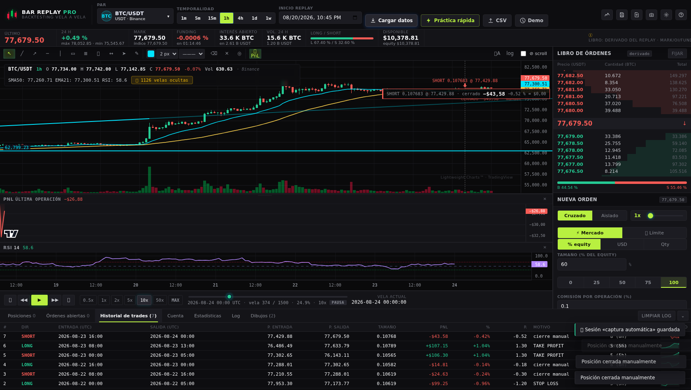

**Operando el replay** — posición LONG con líneas de entrada, SL y TP arrastrables, dibujos
(lineal de tendencia y soporte) y velas futuras ocultas (🔒 contador):

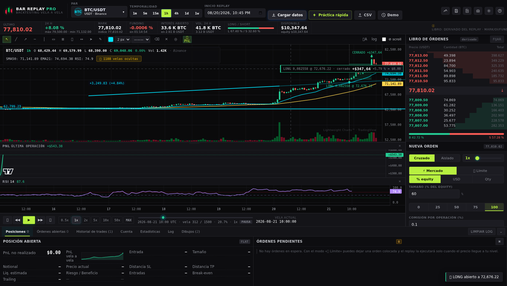

**Indicadores en paneles sincronizados** — Bollinger, RSI, MACD y ATR:

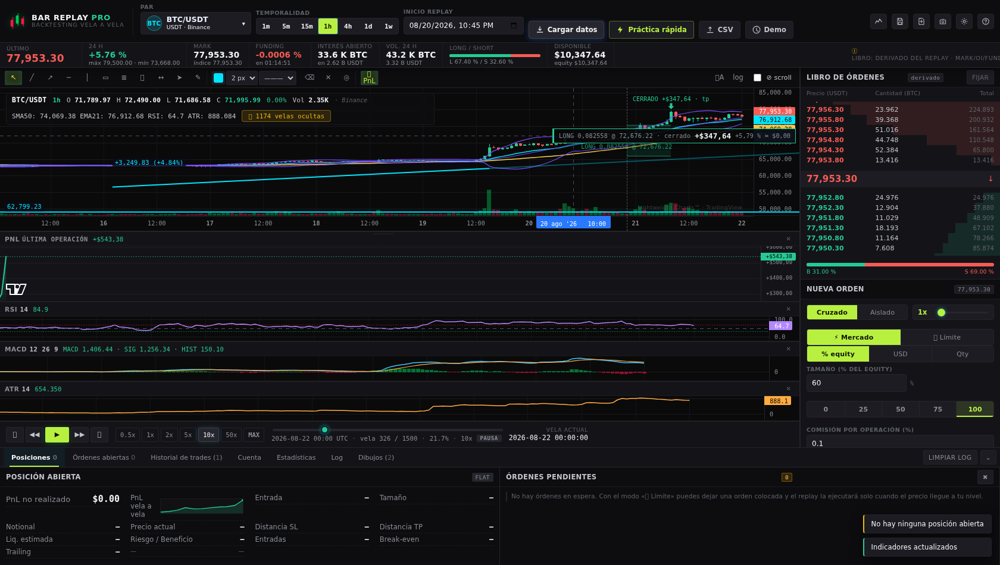

**PnL de la posición, marcado en el gráfico** — banda entrada→precio, tick en la vela de
entrada, etiqueta con el PnL y el panel con la curva vela a vela (a la izquierda, el mismo
marcaje a 390 px de ancho):

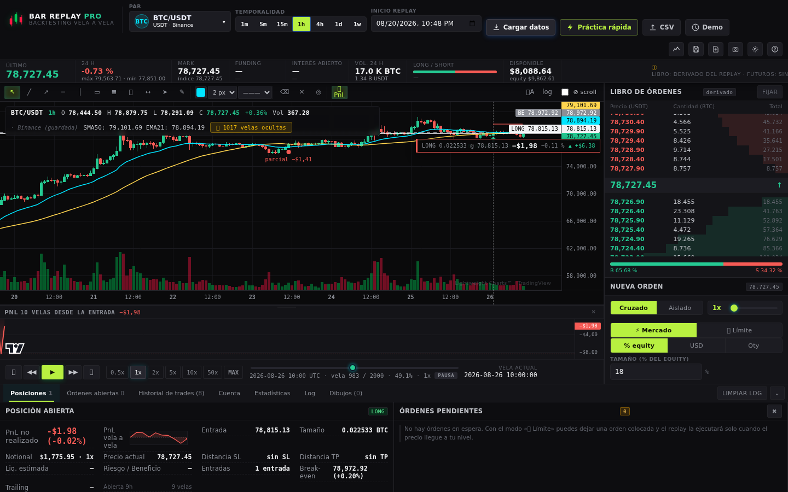

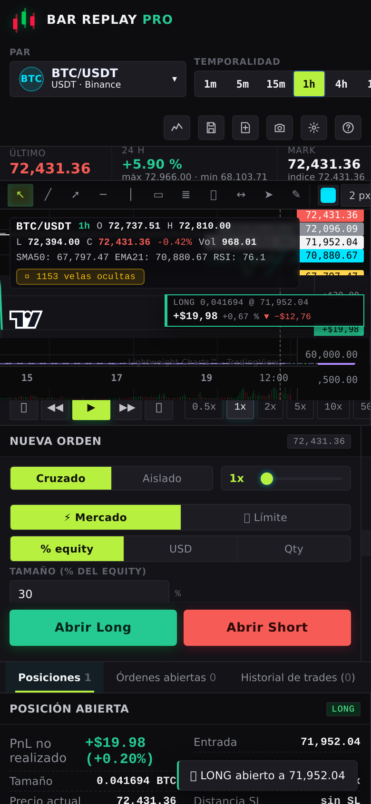

**Panel estirable y mini-PnL en la tarjeta** — el panel de PnL arrastrado a 184 px y,
en la tarjeta de la posición, el pantallazo del recorrido con su «máx/mín»:

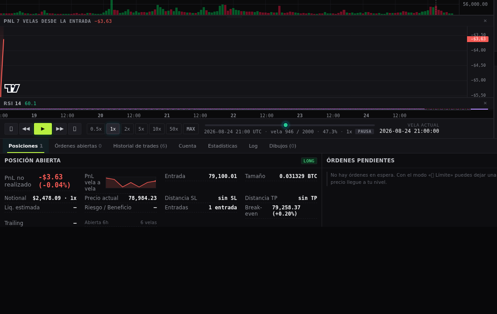

**El recorrido de cada trade, en el historial** — la última columna de la tabla: la fila
de arriba es la posición abierta (mini-curva en vivo, 6 velas) y las demás son trades
cerrados con su recorrido sellado, en el color de su resultado final:

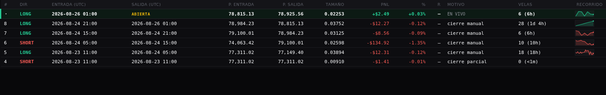

**El asa, con el dedo** (390×844) — el mismo gesto de estirar vale en el móvil: el panel
pasa de su alto de teléfono (72 px) a lo que el hueco permita —aquí 112, con el RSI
apartándose mientras dura el estirado—, la página no se desplaza y las velas no bajan de su
suelo de 120 px:

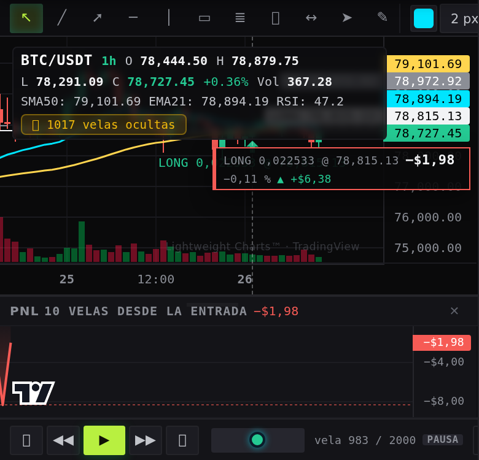

**El formulario del teléfono, cabiendo** (390×844) — a la izquierda como se abre la app
(todo lo esencial a la vista, sin deslizar); a la derecha, el bloque «Avanzado» abierto: la
tarjeta desliza por dentro, la barra de Long/Short sigue fija y el gráfico no ha perdido un
píxel (188 px en los dos estados):

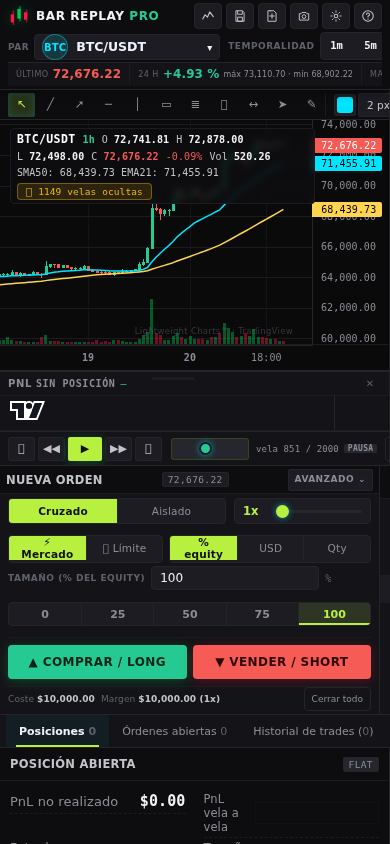
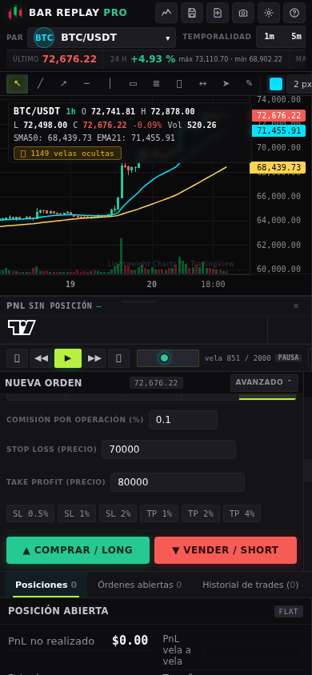

**La barra de replay en el teléfono** (390×844), tal como se ve tras el arreglo: una línea con
los cinco botones de transporte, la perilla en su posición real y el contador con el estado —y la
cola de velocidades, saliendo por el borde, a un gesto de distancia—:


**La escalera de indicadores en el teléfono** (390×844), abierta hasta el último panel: RSI y
MACD con 30 px de gráfico cada uno —antes, 2 px—, sus cabeceras a una línea con los valores
enteros y el eje de tiempo pintado bajo las velas:

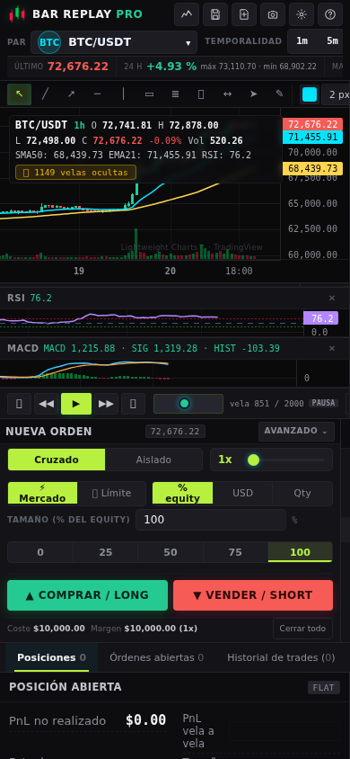

**La barra de dibujo en el teléfono** (390×844), en reposo: las once herramientas y el color a la
vista, el grosor cortándose en el borde derecho (ahí detrás quedan estilo de línea, borrar, limpiar,
imán, PnL, autoescala, log y «⊘ scroll», y todos se alcanzan deslizando) y la caja de la barra
ocupando exacto su fila de 30 px:


**Resultados** — historial completo con motivo de cierre, R múltiplo y duración:

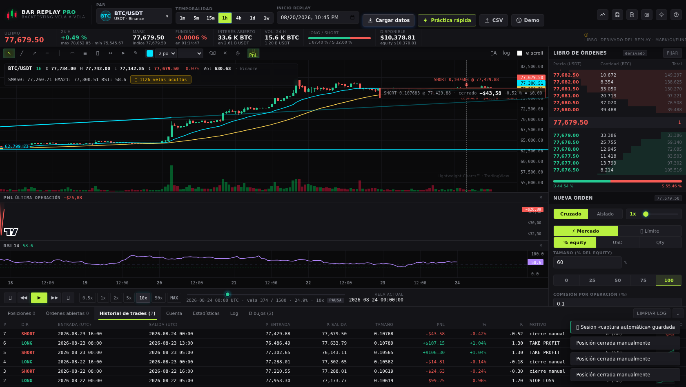

**Buscador de símbolos en vivo** — catálogo completo de Binance (1.183 pares) con
categorías, búsqueda al escribir, favoritos ⭐ y recientes 🕘:

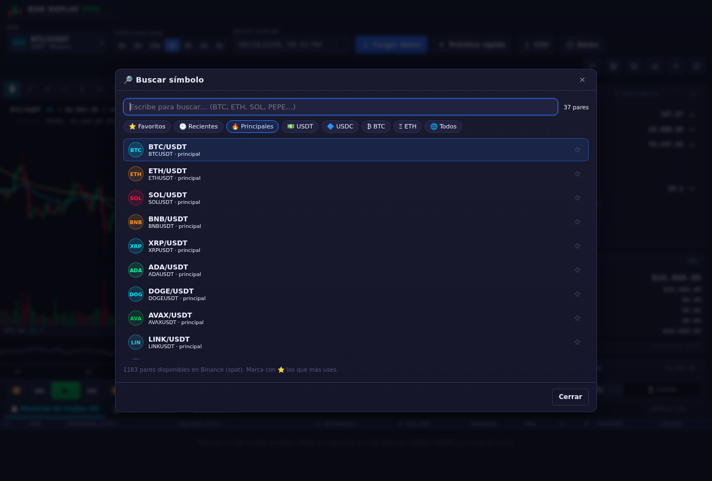

**Dibujar manteniendo pulsado** — el gesto reconoce el trazo y lo convierte en
soporte/resistencia, línea de tendencia, rectángulo, elipse o Fibonacci:

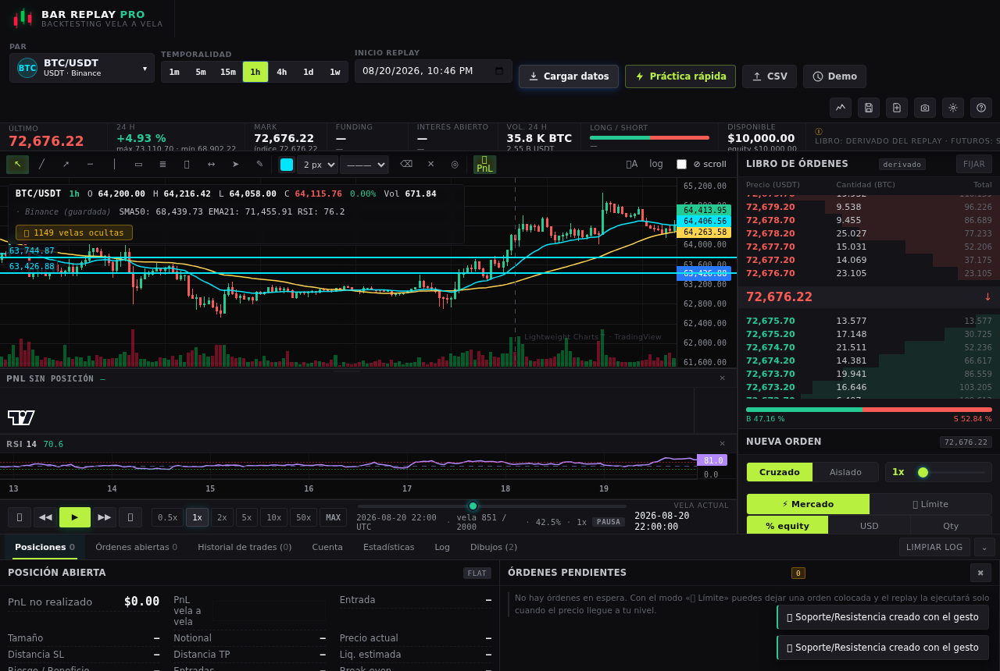

**Flecha, camino y gestor de dibujos** — flecha de proyección, polilíneas libres con su
Δ precio/% y la lista de dibujos con 👁 ocultar, renombrar y borrar:

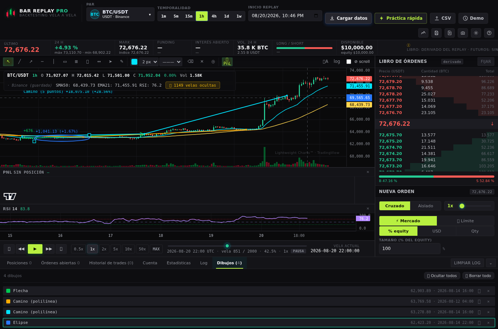

| 37 | **Terminal de futuros (piel Bitunix)**, escritorio 1440×900 |
| 38 | El mismo terminal en **390 px**: gráfico arriba y libro + panel de órdenes en franja |
| 39 | PnL de la posición **marcado en el gráfico** (banda, etiqueta, marcas y panel) |
| 40 | El mismo marcaje a 390 px |
| 41 | Panel de PnL **estirado a mano** + mini-PnL en la tarjeta de la posición |
| 42 | **Historial de trades con el recorrido** de cada operación (la columna nueva) |
| 43 | **El asa arrastrada con el dedo** (390×844): panel 72 → 112 px, escalera plegada, velas intactas |
| 44 | Formulario del móvil **tal cual se abre**: 222 px de contenido en 221 de caja, nada que deslizar |
| 45 | El mismo formulario con **«Avanzado» abierto**: desliza la tarjeta, no el gráfico |

*(37 y 38 las escribe `tests/bitunix.test.js`; 39, 41, 42 y 43, `tests/pnl-chart.test.js`; el resto, `tests/browser.capture.js` en Chromium headless.)*

---

## 🚀 Cómo ejecutarlo

### Opción A — Solo frontend (lo más rápido)
Abre `index.html` en el navegador o levanta un servidor estático:

```bash
cd bar-replay-app
python3 -m http.server 8080
# → http://localhost:8080
```

### Opción A′ — Archivo único, sin servidor ni instalación
`bar-replay-pro-unico.html` es **toda la aplicación en un solo archivo** (≈709 KB:
HTML + CSS + JS + la librería de gráficos incrustados). Se abre con doble clic,
se puede enviar por correo o incrustar en cualquier visor. Sin conexión arranca
en modo DEMO automáticamente.

```bash
npm run build:single     # regenera bar-replay-pro-unico.html desde las fuentes
npm run test:single      # lo verifica en un navegador real CON LA RED BLOQUEADA
```

### Opción B — Con backend Node (recomendado)
El servidor sirve la app y además **proxifica las velas de Binance** en
`/api/v3/klines` (útil si tu red bloquea Binance o hay problemas de CORS).
**No necesita dependencias**: usa módulos nativos de Node ≥ 18.

```bash
cd bar-replay-app
node server.js            # → http://localhost:8080
PORT=3000 node server.js  # otro puerto
```

Si tienes `express` instalado, `server.js` lo detecta y lo usa automáticamente
(`npm install express`). Comprueba el proxy con:

```bash
curl "http://localhost:8080/api/v3/klines?symbol=BTCUSDT&interval=1h&limit=3"
```

### Pruebas

```bash
npm test                    # lógica + DOM simulado
npm run test:net            # carga de velas reales (requiere red / server.js en marcha)
npm run test:browser        # navegador real + capturas en docs/ (requiere puppeteer)

node tests/logic.test.js      # 153 pruebas: indicadores, datos, trading, estadísticas y replay
node tests/dom.smoke.js       #  51 comprobaciones en navegador simulado (requiere jsdom)
node tests/boot.test.js       #  13 comprobaciones de arranque con red bloqueada
node tests/network.test.js    #  10 comprobaciones de paginación y datos reales de Binance
node tests/browser.capture.js #  48 comprobaciones en Chromium real + capturas PNG
node tests/iframe.test.js     #  22 comprobaciones dentro de un iframe sandbox (sin red)
node tests/preview-live.test.js # 17 comprobaciones del preview EN VIVO (datos reales vía proxy)
node tests/responsive.test.js #  133 comprobaciones de tamaño: 10 paneles, sin recortes y
                              #   con RSI + MACD abiertos (el peor caso de la escalera) el
                              #   gráfico no pinta sobre los paneles: caja == fila, 0 solape
                              #   + el bloque «Avanzado» del teléfono, medido pulsando
                              #   + la barra de replay del teléfono: cuatro bordes por control,
                              #     swipe hasta cada velocidad e ida y vuelta del deslizador
                              #   + la escalera del teléfono: hueco pintado por panel, cap con
                              #     deslizamiento, eje en un solo sitio y cabeceras sin corte
node tests/visor-sanitizado.test.js # 9 comprobaciones del visor que no ejecuta JS
node tests/limites.test.js    #  14 comprobaciones de las órdenes límite (ciclo completo)
node tests/gesto.test.js      #  12 comprobaciones del gesto de dibujo (traza con el ratón)
node tests/simbolos.test.js   #  27 comprobaciones del buscador de símbolos y las temporalidades
node tests/pages-buscador.js  #  12 comprobaciones de LA APP PUBLICADA (catálogo real sin servidor propio)
node tests/dibujos.test.js    #  18 comprobaciones de los dibujos: flecha, camino y gestor
node tests/pages-dibujos.js   #  10 comprobaciones de los dibujos EN LA APP PUBLICADA
node tests/pages-promediar.js #  46 comprobaciones del promediado/TP EN LA APP PUBLICADA (solo interfaz). El tramo
                                #   donde el escalón es alcanzable se BUSCA avanzando con ⏭ y el replay se pone en
                                #   pausa: con el azar de la serie de práctica, medir sobre el tramo que tocaba era
                                #   una carrera contra el reloj (un rojo que solo salía con la batería cargada)
node tests/pages-trailing.js  #  57 comprobaciones del trailing stop EN LA APP PUBLICADA (solo interfaz)
node tests/enlaces.test.js    #  16 comprobaciones del enlace al proyecto hermano (OpenMarket Chart)
node tests/temporalidad.test.js # 29 comprobaciones del cambio de temporalidad y de la posición abierta
node tests/entradas.test.js     #  28 comprobaciones de los caminos de entrada: botón, teclado, límite e inversión
node tests/limite-arrastrar.test.js #  26 comprobaciones arrastrando límites y SL/TP con ratón, con dedo y soltando fuera de la ventana (cada bloque limpia antes: nada heredado)
node tests/promediar.test.js    #  82 comprobaciones de promediado, cierre parcial, break-even y TP escalonado
                              #   (82 u 84: un caso se omite solo si en la serie de hoy no hay un -1 % futuro)
                                #   (el bloque del escalonado se monta sobre un tramo DELANTE del cual no salte
                                #   el TP, el SL ni la liquidación: si el escenario no da, el test lo dice con un ✗)
node tests/trailing.test.js     # 101 comprobaciones del trailing stop (68 de motor con velas sintéticas + 33 de interfaz)
node tests/pnl-chart.test.js      # 151 comprobaciones del MARCAJE DE PnL sobre el archivo único, SIN RED, en 10 bloques:
                                #   posición viva (geometría medida contra CM.timeToX/priceToY, número igual al del
                                #   motor, curva que crece y pasa por encima y por debajo del agua), cierre con resumen,
                                #   SHORT + promediado + parcial, interruptor y preferencia (otra pestaña del mismo
                                #   navegador, para que el arranque sea de verdad nuevo), móvil a 390 px CON EL DEDO
                                #   (gesto táctil por CDP), alto del panel y mini de la tarjeta, y el recorrido sellado
                                #   en el historial (I): 13 celdas contra 13 cabeceras, picos conservados por
                                #   PC.reduce, title con máx/mín, y celda vacía en un trade sin recorrido
node tests/pages-pnl.js          #   65 comprobaciones del marcaje EN LA APP PUBLICADA, manejando solo la interfaz
                                #   (sobre el build local son 60 ✓ y 2 omitidas: las 3 comprobaciones de la
                                #   pestaña nueva se cambian por 2 skip, porque en file:// no hay origen
                                #   compartido donde medir la preferencia cruzada)
                                #   (Abrir largo, ⏭, 📈 PnL, Cerrar todo) y abriendo una pestaña nueva para la
                                #   preferencia: recargar la misma se cuelga porque la app pide confirmación al salir
node tests/bitunix.test.js      # 133 comprobaciones de la PIEL BITUNEX sobre el archivo único, SIN RED:
                                #   estructura, libro (10+10, orden visual y recorte honesto), quick sizes,
                                #   coste/margen, liquidación por modo, pestañas y las dos capturas de docs/
node tests/pages-bitunix.js     #   131 comprobaciones de la PIEL sobre LO PUBLICADO: se maneja solo con
                                #   botones y deslizadores reales, y verifica libro, quick sizes, coste/
                                #   margen, liquidación por modo, pestañas y lo que se ve en móvil
node tests/incidencias.test.js # 14 comprobaciones de los avisos de error y diagnóstico
node tests/single.test.js     # archivo único en navegador real sin red
```

```
Resultado actual (`node tools/run-all.js`, todo lo que no depende del despliegue):
**1145 comprobaciones, 0 fallos** ✅ · **23 suites** locales · 1 sin contador (`single.test.js`,
que es un escenario completo de navegador y cuenta sus comprobaciones a medias)
Con las seis que auditan lo publicado (`node tools/run-all.js --publicadas`):
**1455 comprobaciones, 0 fallos** ✅ · **29 suites** · 1 sin contador (`single.test.js`)
(1145 locales + 310 sobre `luisnav83-hash.github.io/bar-replay-pro`, medidas el 2026-10-09
con el despliegue en `a43b959`. Aquí no basta con que la batería esté verde: se comprueba que
lo servido ES lo construido, midiendo el `md5` en la URL pública contra el fichero local —
`bar-replay-pro-unico.html` `8c60162f…` (951 744 B), `index.html` `47646e33`,
`css/bitunix.css` `1af1cfbb`, `js/chart.js` `20df4968`, `js/pnlChart.js` `9e871624`,
`js/uiController.js` `0163b026` y las capturas nuevas `docs/captura-46-barra-replay-movil.png`
`99ad1af5` y `docs/captura-47-escalera-movil.png` `f2deb5df`: los ocho, byte a byte iguales—).
Desglose de las seis publicadas: 12 del buscador + 10 de dibujos + 46 de promediado/TP +
57 del trailing + **120 de la piel Bitunix** (12 comprobaciones nuevas sobre lo publicado: 7 de
la barra de replay del teléfono —deslizador pisable de 20 px, línea de posición dentro de la
barra y no debajo, escala del `<input>` 0..1000 y la perilla siguiendo al replay con el foco
puesto— y 5 de la escalera de indicadores —hueco pintado por panel, cap con deslizamiento, eje
en un solo sitio y estado de los indicadores devuelto—) + 65 del marcaje de PnL

- Nota de la misma fecha sobre `test:pnl` (`tests/pnl-chart.test.js`, dos rojos **deterministas**,
  reproducidos con este incremento aparcado con `git stash` —así se descartó que los metiera él—):
  el bloque que busca «un tramo con PnL en los dos lados» aceptaba tramos donde el precio **tocaba**
  el otro lado en una mecha, mientras la curva de PnL se pinta con el **cierre** de cada vela. Con
  los datos de hoy eso daba una búsqueda satisfecha en la vela 854, un paseo que agotaba las 120
  velas y un `min` de curva 0,00 exacto (el de la entrada), o sea: un rojo que acusaba al marcaje
  de algo que la app no prometía. El criterio del escenario se cambió a cierres —mide lo mismo que
  la comprobación— y el cruce aparece en 45 velas: 151/151. Un rojo hay que empezarlo por saber
  **qué medía exactamente** la comprobación, no por apagarlo.
- Nota de una de estas corridas (2026-10-09): `pages-promediar.js` dio un rojo **dentro de
  la batería entera** y verde en solitario. No era la app: el paseo del nivel usaba la tecla
  `→` y «⚡ Práctica rápida» reanudaba el autoplay por su cuenta, así que teclado y reloj
  avanzaban a la vez (7 teclas = 10 velas de más, la posición cerrada por su propio SL y la
  suite reventando leyendo `.qty` de `null`). El test ahora llama a `App.stepForward()` dentro
  del mismo `evaluate` donde impone `BR.pause()`, y la posición nula se reporta como motivo
  en vez de como `TypeError`. Con eso, la batería publicada volvió a 0 ✗ bajo la misma carga.

> `test:all` ya no encadena suites con `&&`: usa `tools/run-all.js`, que lanza **todas**
> siempre, lee el recuento que imprime cada una y solo al final decide. Con `&&` la primera
> suite que fallaba se llevaba por delante las siguientes y el informe quedaba a medias.
> Las seis suites que comprueban **lo publicado** (`test:pages`, `test:pages-dibujos`,
> `test:pages-promediar`, `test:pages-trailing`, `test:pages-bitunix`, `test:pages-pnl`) se quedan fuera de la
> batería local porque dependen de la red y del despliegue: `node tools/run-all.js
> --publicadas` las incluye (29 suites, y además se puede filtrar:
> `node tools/run-all.js --publicadas bitunix`).
> Cada suite imprime su propio recuento salvo `tests/single.test.js`, que es un escenario completo
> (arranque sin red, operar, leyenda, errores JS) y termina con ✅ sin contador.
> Las suites de navegador **regeneran** los `docs/captura-*.png` que documentan el estado
> actual de la app: si `git status` los lista como modificados después de una batería, es
> lo esperado (llevan el reloj de la máquina impreso), no un cambio de diseño.
> Todas las que derivan precios del mercado lo hacen **de `App.candles` en tiempo de
> ejecución** —nunca a mano— y esperan a que el motor tenga `lastPrice` válido: así no
> dependen de la velocidad de la máquina (un `wait(600)` fijo fallaba bajo la carga de
> la batería completa y hacía saltar el test, no la app).

> Los tests que necesitan servidor (`boot`, `iframe`, `preview-live`, `browser`) **detectan
> solos el puerto** donde escuche `server.js` (o aceptan `BASE_URL=http://host:puerto`).

`tests/dom.smoke.js` necesita jsdom (`npm install jsdom`; si no está se omite solo).
`tests/network.test.js` detecta si hay red o proxy y, si no la hay, se marca como
omitido en lugar de fallar.

---

## 🎮 Flujo de uso

1. Elige **par** y **temporalidad** → pulsa **Cargar datos** (o **Demo** si no hay red).
2. Indica la **fecha de inicio del replay**; verás el histórico previo como contexto y
   el resto oculto (contador «🔒 N velas ocultas»).
3. Avanza con **PLAY**, **▶▶** o el slider de velocidad; retrocede con **◀◀**.
4. Dibuja soportes, canales, Fibonacci… y activa indicadores en **📈**.
5. Abre **LONG/SHORT** con tamaño, apalancamiento, SL y TP (por precio, por % o
   arrastrando las etiquetas en el gráfico).
6. Observa el PnL en vivo; la posición se cierra sola por SL/TP/liquidación o con **Esc**.
7. Revisa **estadísticas**, **curva de capital** e **historial**, y **exporta** el informe.

### ⌨️ Atajos de teclado
| Tecla | Acción |
|---|---|
| `Espacio` | Play / Pausa |
| `→` / `←` | Avanzar / retroceder una vela |
| `B` / `S` | Comprar (Long) / Vender (Short) |
| `Mayús+B` / `Mayús+S` | Colocar **orden límite** de compra / venta |
| `T` | Alternar entre orden a **mercado** y **límite** |
| `Esc` | Cerrar posición (y cancelar dibujo/cerrar modales) |
| lado contrario | Con posición abierta: **invertir** (cierra y abre la nueva) |
| `C` | Cerrar el **50 %** de la posición abierta (parcial) |
| `E` | SL al **break-even** (solo si ya hay ganancia) |
| `V` | **Trailing stop**: activar con el % de la tarjeta / quitar si ya está activo |
| `R` | Reset del replay |
| `Supr` | Borrar el dibujo seleccionado |
| `+` / `-` | Subir / bajar velocidad |
| `1`…`9` | Seleccionar herramienta de dibujo |
| `A` / `P` | Herramienta **flecha** / **camino** |
| `Enter` | Terminar el **camino** en curso |
| `Ctrl+S` | Guardar sesión |

---

## 📁 Estructura

```
bar-replay-app/
├── index.html                # Estructura de la interfaz (todo en español)
├── bar-replay-pro-unico.html # Build de un solo archivo (generado)
├── server.js                 # Backend opcional: estáticos + proxy de klines
├── package.json
├── css/responsive.css      ← reglas de tamaño del tema base
├── css/bitunix.css         ← PIEL Bitunix: tokens medidos, topbar de 2 filas, libro,
│                             panel de órdenes, pestañas y los escalones de altura
│                             (se carga LA ÚLTIMA: puede reescribir al tema anterior)
├── snapshot/velas-reales.json ← velas reales incrustadas (tools/snapshot.js)
├── css/
│   ├── main.css              # Variables del tema, layout, botones, tablas
│   ├── chart.css             # Área de gráfico, toolbar de dibujo, paneles (con el asa .pane-resize), replay
│   ├── panels.css            # Barra lateral y panel inferior
│   └── modals.css            # Modales (indicadores, ajustes, sesiones, export…)
├── js/
│   ├── utils.js              # Formateo, fechas UTC, toasts, sonidos, descargas
│   ├── indicators.js         # SMA, EMA, RSI, MACD, Bollinger, ATR (puros)
│   ├── dataService.js        # Binance paginado, CoinGecko, CSV, datos demo
│   ├── storage.js            # localStorage: caché de velas, sesiones, ajustes
│   ├── statistics.js         # Métricas de rendimiento y exportaciones
│   ├── tradingEngine.js      # Cuenta, órdenes, SL/TP, liquidación, checkpoints
│   ├── barReplay.js          # Motor del replay (play/pausa/velocidad/seek)
│   ├── chart.js              # Gráfico principal, paneles y equity (Lightweight Charts)
│   ├── pnlChart.js           # Marca la posición en el gráfico y su PnL vela a vela (banda,
│                             #   etiqueta, panel con curva de alto ajustable y marcas en las velas;
│                             #   además pinta el mini-PnL de la tarjeta, la mini-curva en vivo de la
│                             #   fila abierta y SELLA el recorrido dentro del trade cerrado)
│   ├── orderBook.js          # Libro del terminal: derivado del replay o real, 24 h,
│   │                         # funding con cuenta atrás, OI y ratio B/S (js/orderBook.js)
│   ├── drawingTools.js       # Herramientas de dibujo sobre canvas
│   ├── uiController.js       # Cableado de la interfaz, modales y atajos (y la mini-curva de
│                             #   recorrido en cada fila del historial de trades)
│   └── app.js                # Inicialización y orquestación
├── vendor/
│   └── lightweight-charts.standalone.production.js   # v4.2.0 (Apache-2.0)
├── tools/
│   └── build-single.js       # Genera el archivo único autocontenido
├── assets/
│   ├── icons/                # favicon.svg
│   └── sounds/               # (sonidos sintetizados con WebAudio)
└── tests/
    ├── logic.test.js         # Pruebas de lógica en Node (153)
    ├── dom.smoke.js          # Prueba de humo con jsdom (51)
    ├── network.test.js       # Carga de velas reales / paginación (10)
    ├── browser.capture.js    # Navegador real (Chromium) + capturas (43)
    ├── boot.test.js          # Arranque robusto sin red / sin localStorage (13)
    ├── temporalidad.test.js  # Cambio de temporalidad + fila de la posición abierta (29)
    ├── entradas.test.js      # Entradas visibles: botón, teclado, orden límite e inversión (26)
    ├── limite-arrastrar.test.js # Arrastre de límites y SL/TP en el gráfico, ratón y táctil (25)
    ├── pnl-chart.test.js     # Marcaje de PnL sobre el archivo único sin red (151)
    ├── pages-pnl.js          # El mismo marcaje sobre lo publicado (65)
    └── single.test.js        # Archivo único en navegador real sin red
```

---

## 🧠 Notas técnicas

- **Sin fuga de futuro**: el gráfico recibe solo las velas hasta el cursor. Los
  indicadores se calculan sobre la serie completa porque son **causales** (el valor de
  la vela *i* no depende de velas posteriores) — la prueba `logic.test.js` verifica
  esta propiedad explícitamente.
- **Rendimiento**: al avanzar una vela se usa `series.update()` (O(1)); al retroceder o
  saltar se reconstruye con `setData()`. El avance rápido agrupa varias velas por
  fotograma y los eventos de UI se silencian en lote (`TE.beginBatch/endBatch`) y se
  refrescan una sola vez. La caché limita a 6.000 velas por par/temporalidad.
- **Zona horaria**: todas las marcas de tiempo son **segundos UNIX en UTC**; los
  `datetime-local` se interpretan como UTC explícitamente.
- **Cambiar de temporalidad o de par**: el replay **conserva el instante exacto** (ancla
  temporal `App.focusTs`) y la vela elegida es siempre la que *contiene* ese instante
  (`time <= fecha`), nunca la siguiente: así pasar de 1h a 1d/1w no adelanta velas futuras.
  Encadenar 15m → 4h → 15m vuelve al mismo minuto. Si estaba reproduciendo, **sigue**
  después de cargar. Con posición abierta se cierra a mercado (motivo «cambio de serie»)
  y los límites pendientes se cancelan, avisando en pantalla.
- **Promediar entradas, TP escalonado y trailing (como Bitunix)**:
  - **Add position / promediar**: con una posición abierta, `COMPRAR`/`VENDER` (o
    `➕ Añadir` en la tarjeta de posición) **suma tamaño** al precio actual. La entrada pasa a
    ser el **precio medio ponderado** (`TE.addToPosition`), el notional y el margen se suman y
    la **liquidación se recalcula sobre el total**. Cada tandada queda en `position.parts`
    (se dibuja su precio en el gráfico) y el número de promediados en `position.additions`.
    Los niveles de **TP/SL se conservan** —es el comportamiento *Position TP/SL*, donde la
    cantidad ejecutada se ajusta sola al cambiar el tamaño—; la casilla **re-aim** los
    recoloca a la misma distancia porcentual del nuevo precio medio. Con el promediado
    **desactivado** (Ajustes → `➕ Promediar entradas`) se vuelve al aviso clásico.
  - **Cierre parcial**: `➗ 25 / 50 / 75 %` o la tecla `C` realizan el PnL de una fracción
    (`TE.reducePosition`) y dejan el resto vivo con su SL/TP. Cada parcial es una fila en el
    historial con `parcial: true` y motivo `cierre parcial`, y **descuenta su parte** de la
    comisión de apertura, de modo que `balance = capital + Σ PnL` sigue cuadrando al cerrar.
  - **Break-even**: `TE.breakEvenPrice()` resuelve el PnL neto cero
    (`x = (openFee + media·q·dir) / (q·(dir − fee))`), así que **no** coincide con el precio
    medio: incluye comisiones. `🛡 BE` o `E` llevan el SL ahí (`TE.setSL(x, {force:true})`);
    si la posición está en pérdida se **niega** y lo explica, porque un SL por encima del
    precio en un long sería un cierre inmediato.
  - **Partial TP/SL**: `🎯 TP escalonado` acepta varios precios, cada uno con el % de la
    posición que cierra (`TE.addTpLevel`). En `TE.onCandle` se evalúan **antes** del TP de la
    posición y después del SL: cada nivel tocado cierra su fracción y se retira de la lista;
    lo que sigue abierto conserva su SL.
  - **Trailing stop** (`🌀` en la tarjeta de posición, tecla `V`): el stop no tiene un precio
    fijo, sino que persigue al **mejor precio alcanzado** (el *pico*) separado siempre el mismo
    % —el *Callback ratio* del exchange—. `TE.setTrailing({pct, activation, frac})`:
    - `pct` es el retroceso que dispara; `activation` (opcional, *Activation price*) es el
      precio a partir del cual empieza a seguir, para que el primer ruido en contra no cierre
      la posición; `frac` permite que cierre solo una parte (100 % por defecto, como el
      *Partial TP/SL* pero en el lado del stop).
    - Con el pico ya definido, el nivel es `pico·(1 − pct)` en longs y `pico·(1 + pct)` en
      shorts; **el pico solo sube** (baja en shorts) y nunca se afloja.
    - Se ejecuta **como un stop**: si la vela abre con el nivel cruzado (hueco) se rellena a la
      apertura, con deslizamiento (`TE._fillPrice`), igual que el SL.
    - **Criterio con velas OHLC**: el pico se actualiza al *cerrar* la vela, después de evaluar
      el disparo. Una vela no puede disparar un nivel que ella misma acaba de crear, porque
      dentro de ella no se sabe si el `high` pasó antes o después del `low`. Es el mismo sesgo
      pesimista que se usa cuando SL y TP caen en la misma vela, y está fijado por test
      (`B) el pico sube al cerrar la vela, y la vela no se dispara a sí misma`).
    - Si el **SL fijo y el trailing** se tocan en la misma vela ejecuta **el más cercano** al
      precio (en un long, el nivel más alto), que es lo que haría el bróker.
    - Al promediar, el trailing **se queda donde está**: defiende el pico de la *posición*, no
      el precio medio nuevo (así lo hacen los exchanges), y el log lo dice. Sobrevive a
      checkpoints, a `serialize()` y a guardar/cargar sesión.
    - En el gráfico se ve como línea `TRAIL` morada que se mueve sola; en la tarjeta, como
      `pico → nivel (distancia %)`, y «arma en …» mientras espera la activación.
  - **Órdenes límite del mismo lado** con posición abierta **promedian** al tocarse (los del
    lado contrario siguen en espera hasta cerrar, como antes).
- **Arrastre sin ratón perdido**: los handles de SL/TP y de límite se consuelidan al soltar
  (`DT._onUp`), y también si se **pierde el foco** de la ventana (`blur`/`pointercancel`): antes,
  soltar fuera del navegador dejaba la pestaña pegada al cursor. Durante el arrastre los cambios
  se aplican **en silencio** (un log por cada `mousemove` llenaba el registro) y solo el gesto
  terminado deja línea en el log y sonido.
- **Órdenes límite arrastrables**: la línea ámbar de cada orden pendiente tiene una pestaña
  `⏳▲ ⇕` en el borde derecho y se puede **arrastrar** para reubicar el nivel, con la misma
  mecánica que los handles de SL/TP (`DT.setPendingHandles` → `App.moveLimitOrder`). Con el
  puntero sobre la línea el cursor cambia a `grab`; el campo de precio del panel y la lista
  de pendientes siguen el arrastre en vivo. Si al soltar el nivel queda **cruzado** con el
  precio actual, la orden se ejecuta a mercado (`TE.executeNow`). También con el dedo
  (`touchstart/move/end`, capturado solo cuando el gesto empieza sobre un handle).
- **Una posición a la vez**: con posición abierta, las **órdenes límite quedan en espera** y
  se ejecutan al cerrarla (queda anotado en el log y se avisa con un toast).
- **Invertir**: con una posición abierta, pedir el **lado contrario** (botón o tecla)
  cierra la actual y abre la nueva; el historial anota el motivo «inversión». Pedir el
  mismo lado avisa y no toca la posición.
- **La entrada, siempre visible**: mientras la posición vive, el historial muestra una
  fila «ABIERTA» con PnL flotante, %, R y barras actualizadas **en cada vela**
  (`UI.updateOpenTradeRow`); el contador de la pestaña cuenta solo las cerradas.
- **Modelo de ejecución intrabar**: con OHLC no se conoce el orden de los precios dentro
  de la vela, así que la ambigüedad SL/TP se resuelve de forma **pesimista** por defecto
  (configurable en Ajustes) y los huecos se rellenan al precio de apertura.
- **Comisiones**: se cobran al abrir y al cerrar; el PnL del trade las incluye ambas,
  de modo que `balance = capital inicial + Σ PnL` siempre cuadra.
- **Reinicio por checkpoints**: cada vela avanzada guarda un estado compacto de la
  cuenta (balance, longitud del historial, copia de la posición abierta y longitud de la
  curva de capital), así retroceder es instantáneo y determinista.
- **Privacidad**: todo se ejecuta en tu navegador; no hay telemetría ni servidores
  propios. La caché y las sesiones viven en `localStorage`.
- **Arranque a prueba de bloqueos**: el orden de hosts prueba PRIMERO el proxy del
  mismo origen (respuesta en ~1,4 s con `server.js`), cada petición tiene un timeout
  de 6 s y todo el arranque un presupuesto de tiempo. Si la red no responde en 9 s,
  la app carga datos DEMO y sigue siendo totalmente usable (probado en
  `tests/boot.test.js` con un `fetch` que nunca contesta y `localStorage` bloqueado).
  Si los datos reales llegan más tarde y aún no has operado, se avisa con un toast.
- **Velas REALES dentro del archivo**: `bar-replay-pro-unico.html` lleva incrustadas
  4.000 velas reales de Binance (BTC/USDT 1h + 15m, ETH/USDT 1h) en
  `snapshot/velas-reales.json`. En un entorno sin internet la app **no** enseña
  datos inventados: usa esas velas reales (leyenda `· Binance (guardada)`).
  Para actualizarlas: `node server.js` + `node tools/snapshot.js` + `node tools/build-single.js`.
  Los datos sintéticos DEMO quedan solo como último recurso (pares/temporalidades
  sin instantánea), siempre señalados en ámbar.
- **A prueba de visores que "sanean" el HTML**: algunos visores (p. ej. la vista
  previa en móvil) eliminan las etiquetas `<script>` pero dejan su CONTENIDO, con lo
  que el código aparecía como texto suelto por la pantalla. Ahora el `<script>` va
  dentro de un contenedor oculto (`#brpJS`): si el visor borra las etiquetas, el
  código queda invisible; si el navegador es normal, se ejecuta igual. Además, el
  aviso de emergencia explica cómo abrir la app en un navegador de verdad.
- **Nunca se queda muda**: si el entorno bloquea JavaScript, aparece un cartel de
  emergencia que lo explica (`#brpNoJS`); si algo falla al arrancar, se muestra un
  informe rojo con el error exacto y 13 datos de diagnóstico (módulos cargados,
  almacenamiento, canvas, si está dentro de un iframe…) y un botón **Copiar informe**.
  El arranque es resistente a visores que inyectan el HTML ya cargado
  (`document.readyState !== 'loading'`).
- **Layout adaptable a CUALQUIER entorno**: el cuerpo es una columna flexible, así que
  el gráfico se ajusta al alto/ancho disponible. Verificado a 1680×950, 1280×700,
  900×700 y 480×900 con **0 px de desbordamiento** en todos los casos, manteniendo el
  gráfico ≥200 px de alto y los controles de replay/compra siempre accesibles
  (`captura-06-ventana-pequena.png`, `captura-10-movil.png`).
- **Un `grid` puede estar mintiendo por su contenido mínimo** (caza de esta sesión,
  `css/chart.css`): al estrechar la ventana, `#chartWrap` y `#mainChart` **no volvían
  a encogerse** —se quedaban en 1102 px dentro de un viewport de 390 px, recortados—
  porque la columna implícita de `#chartArea` la fijaba el *min-content* de
  `#drawToolbar` (un flex `nowrap` de 1102 px). Tres líneas lo arreglan y son la
  lección: `#chartArea { grid-template-columns: minmax(0,1fr) }` (así la pista puede
  bajar de su mínimo), `#chartWrap { min-width:0; overflow:hidden }` y
  `#drawToolbar { min-width:0; overflow-x:auto }` (la barra de dibujo, si no cabe,
  se desplaza en vez de estirar el gráfico). Medido tras el arreglo: pista de 389 px
  y `#chartWrap` de 389 px con 0 px de scroll horizontal. Es un `min-width:auto`
  heredado del flex/grid: **un `1fr` sin `minmax(0,…)` no es un «ocupa lo que
  sobre», es un «ocupa lo que sobre, pero nunca menos que tu contenido más ancho»**.
  `tests/pnl-chart.test.js` (bloque F) y `tests/responsive.test.js` lo vigilan.
- **Un `style.height` puesto «por si acaso» rompe una escalera de alturas** (mismo
  episodio, esta vez del panel de PnL): al arrancar se medía el alto del panel y se
  devolvía como estilo en línea, y con eso **ganaba por cascada** a los escalones de
  `css/bitunix.css` (`.indPane` a 56/48 px en ventana baja) → el gráfico perdía 60 px
  y `tests/browser.capture.js` cantó 229 px contra su contrato de ≥240 a 1280×700.
  Ahora el estilo en línea solo aparece cuando la persona eligió un alto (o había uno
  guardado); sin eso manda la escalera. Y, medido, la fila del mini de la tarjeta **no
  costaba ni un píxel** de gráfico (el cuerpo de la tarjeta tiene su propio scroll), así
  que se quitó el `@media (max-height)` que la ocultaba: una regla justificada con una
  cifra falsa es peor que no tenerla.
- **En el móvil el alto del panel de PnL no lo da la página: se lo quita al gráfico** — y
  por eso el arreglo tiene que ser del andamio, no del gesto (medido en 390×844).
  `body` lleva `overflow:hidden` y el documento mide 844 px = viewport, así que no hay
  «más abajo» adonde empujar; el reparto era cabecera 190 + workspace 504 (área de
  gráfico 256 = barra de dibujo 30 + fila del gráfico + escalera 145 + replay 38) +
  registro 150, y a las velas les quedaban **43 px de fila**. Lo que engañaba a los
  contratos: `#chartWrap` medía 200 px **de caja** porque su `min-height` lo exigía, pero
  la caja desbordaba la fila y **se pintaba encima de su propia escalera** (solape medido:
  157 px). Un assert sobre `getBoundingClientRect().height` no puede distinguir «200 px
  útiles» de «200 px encima de otra cosa»: ahora se comprueba también que **caja == fila**
  y que el solape es 0.
  Lo que se compactó (medido, con la sonda de reparto): barra superior de 4 filas a 3
  (marca + botones a la par; «Par»/«Temporalidad» en una línea sin la coletilla «USDT ·
  Binance») → 190 → **135 px**; registro 150 → **130 px**; escalera del móvil PnL 92 →
  **72** y RSI 52 → **44 px**. Resultado: la fila del gráfico en 390×844 pasa de 43 a
  **146 px** y en 480×900 a **204 px** —los 200 que pide `tests/browser.capture.js`, que
  se cumplen sin tocar nada más—, con caja == fila y 0 px de solape en las dos.
- **La barra superior del teléfono, 135 → 90 px (2026-10-09).** Con el formulario de
  órdenes ya compactado, lo único que separaba al gráfico de 200 px era el andamio de
  arriba: 38 (marca + iconos) + 51 (par, temporalidad, fechas, DEMO) + 36 (estadísticas
  24 h) + 10 de padding. Se aprieta **sin ocultar nada** (la fila del par ya era
  deslizable en horizontal, así que las siete temporalidades y los botones de carga siguen
  todos ahí), y todo lo que baja es medido:
  · marca a 22 px de logo y 12 de letra; iconos a 26 de diana (el mínimo táctil de 20 del
    contrato se respeta);
  · par, temporalidad y fechas con la **etiqueta en línea** y `margin-bottom:0` en
    `.field` —dentro de la barra esos 7 px del margen de los formularios en columna eran
    la diferencia entre una fila de 41 y una de 32—: fila 51 → **32 px**;
  · estadísticas 24 h con cifra a 12 px, etiqueta y subtítulo **en la misma línea**, y
    `--stats-h: 24px` en el teléfono: fila 36 → **24 px**. Ese `--stats-h` es la trampa:
    la regla base le da un `height` fijo a `.bf-stats`, así que poner los chips en una
    línea no bastaba —la fila seguía midiendo 36 con 22 de contenido—;
  · y la que sí era un defecto de verdad: `.bf-stat` tope a `max-width:230px` con
    `text-overflow:ellipsis`. Al pasar a una línea, «máx 72,966.00 · mín 68,390.00»
    medía 258 contra 230 de caja y **el mínimo del día se leía roto en el móvil**. Sin
    tope, cada chip pide su ancho y la fila desliza 30 px más: ningún dato fuera (lo
    comprueba `tests/responsive.test.js` midiendo `scrollWidth > clientWidth` de cada
    cifra y `tests/pages-bitunix.js` sobre lo publicado).
  Resultado medido en 390×844: barra **90 px** (filas 28/32/24), fila del gráfico
  **189 px** con la escalera por defecto del propio build publicado y **234 px** con los
  paneles de indicadores cerrados (antes 146 y 189), **146 px** en el peor caso de tres
  paneles —ahí el límite lo fija el mínimo de los paneles, no el andamio, y la ganancia
  se la comen ellos: por eso el contrato de esta fila es geométrico (caja == fila,
  solape 0) y no un número—; `docH == vh` (la página sigue sin deslizar), 0 px de scroll
  horizontal y la temporalidad activa y el botón DEMO, alcanzables deslizando su fila
  (`no → sí` con `elementFromPoint` en el centro).
  **La franja de órdenes se quedó en 250 px, y no fue pereza**: bajarla a 200 metía 48 px
  de velas más en el gráfico pero sacaba del recorte el botón del trailing y las filas de
  TP/SL —`tests/pages-trailing.js` lo cantó sobre lo publicado («el centro del botón está
  despejado para recibir el dedo (nada)», con el centro del botón en y 845 de una pantalla
  de 844)—. Un botón que no se puede pulsar no se paga con un gráfico más alto. Lo mismo
  con el registro: a 100 px pasaba igual; a 130 las tarjetas siguen alcanzables.
  Y la rejilla de la barra superior vive en el bloque **de ancho ≤1000 px**, no en el de
  alto: la primera versión estaba atada a `max-height:820px` y dejaba al teléfono de 844
  px sin rejilla (barra de nuevo en 176 px, medido). Al subirla al bloque de ancho cayó
  gratis un defecto viejo que nadie había visto: a 900×700 el `min-height:150px` del
  lienzo desbordaba **41 px por encima de sus propios paneles** (fila real 108,7 px); hoy
  la barra mide 137, la fila 151,7 y el solape 0.
  En teléfonos ADEMÁS bajos (≤760 px de alto: 360×640, 390×667) el `#chartArea` se queda
  con su suelo de 350 px y **el terminal se desplaza en vertical** en vez de solaparse
  (medido: 360×640 → documento de 847 px en una pantalla de 640, fila del gráfico 169
  px). Y se probó el atajo de poner la fila del workspace en `auto` sin compactar nada:
  **no sirve**, con dos filas `auto` que piden 363 + 248 el contenedor de 504 las recorta
  a 256 + 248, idéntico a lo de antes (lo dice el comentario de `css/bitunix.css` §10).
- **Lo que mide un contrato tiene que ser lo que se PINTA (2026-10-09), y el mismo defecto
  apareció dos veces en la misma tarde.** Al topar la escalera del teléfono con
  `#paneArea{max-height:117px;overflow-y:auto}`, los paneles no desbordaron: **encogieron** a
  36 px (8 de gráfico), porque `#paneArea` es `flex-direction:column` y los hijos tienen
  `flex-shrink:1` por defecto → `flex:0 0 auto`. Es literalmente la corrección que había
  necesitado media hora antes la barra de replay (`.rb-progress` a `width:0` por el mismo
  mecanismo), y la detecta el mismo tipo de comprobación: el alto del *canvas*, no el del
  contenedor. Las tres mediciones que hubo que reescribir en este bloque, todas por lo mismo:
  (1) el `solape` contra el `getBoundingClientRect()` de un panel desbordado —fuera de la caja
  que lo recorta no se pinta nada: se mide `min(hijo, caja)` y, aparte, que la caja termine por
  encima del replay—; (2) preguntar «¿dónde está el eje?» a la librería, cuando
  `timeScale().getOptions()` no existe en v4 (contaba 0 ejes y el rojo salía en las diez tallas
  por un assert tonto, no por un defecto) —se mide la franja que le falta al canvas, que ES el
  eje—; (3) un bloque de test que mutaba el estado de los indicadores y dejaba el gráfico 56 px
  más alto para los asserts de más abajo (`pages-bitunix.js` comparaba el antes y el después de
  abrir «Avanzado» y el comparado ya no era el mismo): **un bloque que toca el estado lo
  devuelve**, y se comprueba que lo devolvió. Y la lección de fondo del eje: cuando un elemento
  reparte un hueco fijo (24 px de cabecera, ~26 de eje), «el panel mide 44 px» no dice nada de
  lo que se ve —lo que se ve son 2 px—; los contratos de este proyecto miden desde entonces el
  hueco pintado, no la caja pedida.
- **Un contrato de una medida compartida se arregla quitando la segunda fuente (2026-10-10).** La
  barra de dibujo medía 28 px de caja en una fila de 30 en TODOS los paneles de menos de 700 px de
  alto, porque la fila la fija `--toolbar-h` y el tier reescribía el alto de la barra a mano. Poner
  28 en los dos sitios habría callado el rojo y dejado la trampa puesta; se borró la regla del tier,
  la variable manda en las dos y el defecto deja de ser representable —el assert (`fila === caja` en
  cuatro tallas) queda de centinela, y se comprobó que muerde reproduciendo el estado viejo sobre el
  fichero construido, porque un centinela que no puede ponerse rojo es decoración: dos de las tres
  mutaciones que probé lo pusieron, y la que no (quitar solo la variable) demostró que ahora es
  imposible desincronizar las dos medidas escribiendo un solo sitio—. Tres falsedades del test, y no
  de la app, salieron en este bloque: una sonda marcaba «0 de 21 controles alcanzables» en una barra
  perfecta porque su helper llamaba `h` a la altura y el guard pedía `.height` (`undefined` → falsy →
  todos fuera: **la segunda vez que el `R()` corto de este proyecto muerde**, y ya va siendo costumbre
  escribir el helper con las claves completas cuando el assert depende de un `if (!r.alto)`); el toque
  corto publicado daba «la barra está sorda» porque sin `Emulation.setTouchEmulationEnabled` Blink no
  convierte un `touchEnd` en `click` (se enciende y se apaga por CDP, que no obliga a recargar y así
  no se pierde el estado que las comprobaciones de encima acaban de medir); y las coordenadas del toque
  se habían medido ANTES de la pasada de al lado, que deja la barra deslizada 185 px —el dedo caía en
  «arrow» en vez de «hline»—. Y para quien añada un bloque que cambie el viewport: los bloques de
  captura de `responsive.test.js` no ponen el tamaño, **lo heredan**; el mío lo dejó en 1280×800 y las
  cuatro capturas del móvil salieron a tamaño de escritorio hasta que el bloque lo devuelve.
  - **La barra de replay del teléfono, y la escala del deslizador (2026-10-09).** Dos defectos
  que estaban en TODAS las pantallas y uno que solo se veía en el móvil. (1) El
  `<input type="range">` de posición llevaba `max="100"` mientras `UI.refreshReplayBar`
  escribe `fracción·1000` y `App.seekFromSlider` divide entre 1000: el navegador **clampa** el
  valor, así que la perilla nacía pegada a la derecha (medido: `value` 100 en la vela 300 de
  1500) y arrastrar no sacaba del 10 % del histórico. La escala del elemento y la del código
  son un contrato —mudo: ni un error, ni un rojo si nadie compara la perilla con el índice—.
  (2) El repintado «respetaba» al usuario con `document.activeElement !== slider`, que en un
  `<input>` quiere decir «para siempre en cuanto lo hayas tocado»: la perilla se congelaba
  mientras el contador seguía subiendo. El permiso tiene que vivir en el **gesto**
  (`pointerdown` → `UI._arrastrandoSlider`) y quitarse en `pointerup`, **`pointercancel`** y
  `blur` de la ventana —en el teléfono el gesto se lo queda el deslizamiento de la barra, y
  sin esa rama el replay se quedaba pausado hasta recargar—; y al soltar hay que **pedir el
  repintado** (`UI.refreshReplayBar()`), porque sin él la perilla se engancha hasta la vela
  siguiente (a 1×, un segundo: medido 24 contra 426). (3) En ≤640 la línea de posición del
  replay no se veía nunca: `css/chart.css` ponía el bloque en columna y `css/responsive.css`
  envolvía la barra, y una segunda línea fuera de un contenedor de 34 px con `overflow-x:auto`
  (y vertical oculta) no se recupera deslizando. Tres reglas de método de esta pasada:
  **`grep` del selector en TODOS los `css/*.css` antes de tocar uno** (aquí mandaban dos
  ficheros que no era `bitunix.css`, y las reglas nuevas no entraban por nada), **comparar los
  cuatro bordes** de cada control con los de su contenedor (la primera sonda miraba solo el
  derecho y llamaba «bien» a un recorte por abajo), y en una fila deslizable declarar
  alcanzable un control solo si se puede pulsar en **algún** punto del `scrollLeft` —medido en
  reposo, los siete chips de velocidad parecían perdidos y estaban a un gesto—.

- **El `min-height` de un gráfico en una fila `1fr` no agranda la fila: desborda.** Este
  era el hermano mayor del defecto del móvil, y tampoco era del móvil: con RSI + MACD
  abiertos el lienzo se pintaba ENCIMA de sus propios paneles de indicadores —**69 px a
  1440×900, 66 px a 1024×768, 46 px a 900×700, 75 px a 1000×780**, medido en esta pasada—.
  Ninguna suite lo veía porque las comparaciones eran «paneles contra la barra de replay» y
  «área contra el workspace», nunca «caja del gráfico contra su fila». Lo arregla
  `PC.comprimeEscalera()` (`js/pnlChart.js`): si el gráfico rebasa su fila se **aprietan**
  los paneles de indicadores —nunca por debajo de `MIN_PANE` (40 px)— y, si aun así no
  cabe, se baja el `min-height` del gráfico hasta lo que dé la fila, con un suelo duro de
  90 px. Ocultar un indicador que la persona acaba de abrir es peor que verlo bajo, y
  tapárselo, lo peor. Cuatro detalles que costaron rojos y que están escritos en los tests:
  (1) el reparto se decide **contra el CSS** —se quitan los `style.height` propios, se mide
  y se vuelve a aplicar—, porque medir «lo que ya está puesto» convertía el
  `ResizeObserver` en un vaivén sin fin; (2) hay que contar los **bordes** del contenedor
  de la escalera (`gaps` medidos) o siempre sobra 1-2 px y el `solape === 0` no se cumple
  nunca en los altos raros; (3) al soltar se limpia **toda** la escalera, también los paneles
  ocultos, porque un inline olvidado reaparece la próxima vez que se abre el indicador (lo
  cuenta el bloque J de `tests/pnl-chart.test.js`: «0 de 0 esperados»); (4) el panel de PnL
  **nunca** se toca —su `style.height` es la preferencia de la persona—, y la primera
  versión se lo borraba al primer resize: el dedo dejaba de estirar («72 → 72 px»).
- **Una columna nueva en una tabla se añade AL FINAL y se arregla la fila abierta**
  (esta vez contra un rojo de test, no a posteriori): el historial fija en otras suites
  que el «Motivo» esté en `td:nth-child(11)` y que el `textContent` de la fila no cambie,
  así que la mini-curva entra como decimotercera celda y, si no hay recorrido, la celda
  va **vacía** con su `title` (un «—» habría cambiado el texto que comparan
  `trailing.test.js` y `pages-promediar.js`). Y `UI._openTradeRow` tenía que ganar su
  celda también: 12 celdas contra 13 cabeceras es una tabla desalineada que NINGÚN test
  de «existe la columna» detecta — el detector es contar `tr.children` contra `th`.
- **Funciona dentro de la sandbox de vista previa**: probado en un iframe con
  `sandbox="allow-scripts"` con internet externo bloqueado — la app carga **datos reales
  de Binance vía el proxy del mismo origen** de `server.js` (`captura-09-preview-sandbox.png`).

## ⚠️ Descargo de responsabilidad

Herramienta **educativa**. La simulación simplifica la realidad (liquidaciones, slippage,
profundidad de mercado, funding real) y los datos pueden contener errores de la fuente.
Nada de lo que muestra constituye asesoramiento financiero. Practica, aprende y arriesga
solo lo que puedas permitirte.

## 📜 Licencia

MIT. Incluye **TradingView Lightweight Charts v4.2.0** (licencia Apache-2.0, © TradingView Inc.)
y datos públicos de Binance/CoinGecko.
